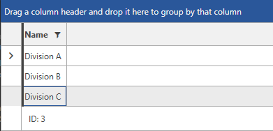
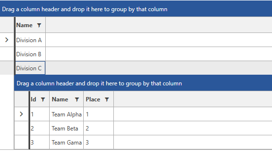

# Row Details Template

The __Row Details__ template is defined through the __RowDetailsTemplate__ property of the __RadGridView__.

>tip To learn how to manage the displaying of the __Row Details__, read [this topic]().
	
## Basic RowDetails Template

__Example 1__ shows a basic row details template. You can observe the result in __Figure 1__.
		
> The next examples use the __Team__, __Division__ and __DivisionService__ classes defined in Examples 1, 2 and 3 in the following [article](). The setting of the ItemsSource in Examples 1 and 2 is shown in __Example 3__.

__Example 1: Basic RowDetails Template__

<snippet id='radgridview-row-details-template-example_1_basic_rowdetails_template-xaml' />

__Figure 1:__ Displays the result of the applied __Basic RowDetails Template__.

## Complex RowDetails Template

__Example 2__ shows a complex row details template, which contains another RadGridView. You can observe the result in __Figure 2__.

__Example 2: Definition of Complex RowDetails Template__

<snippet id='radgridview-row-details-template-example_2_definition_of_complex_rowdetails_template-xaml' />

>important You should specify fixed dimensions for the RadGridView in the RowDetailsTemplate (Height/MaxHeight and Width/MaxWidth). Otherwise the [UI Virtualization]() mechanism will be disabled. 

__Figure 2:__ Displays the result of the applied __Complex RowDetails Template__.  

__Example 3: Setting the ItemsSource for Examples 1 and 2__

<snippet id='radgridview-row-details-template-example_3_setting_the_itemssource_for_examples_1_and_2-cs' />

<snippet id='radgridview-row-details-template-example_3_setting_the_itemssource_for_examples_1_and_2-vb' />

## See Also  
 * [RowDetails Overview]()  
 * [Toggle RowDetails Column]()
 * [Row Details Visibility]()
 * [External Row Details]()
 * [Customizing the Row Details]()