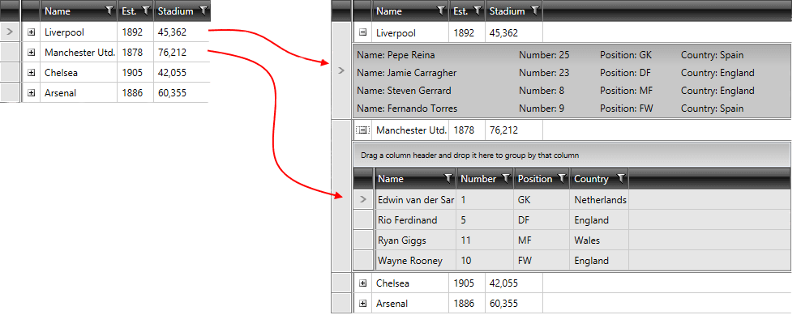

# Row Details TemplateSelector

The __RadGridView__ provides a [RowDetailsTemplate]() property and different [RowDetailsVisibility]() options. By default their values are inherited by all rows in the grid.         

You can apply a RowDetailsTemplate conditionally through specifying a proper __RowDetailsTemplateSelector__. You can check the [TemplateSelectors Overview]() article for more information on how to do so.         

>If you want to have a different template for a specific __GridViewRow__, you can do this through applying a [RowDetailsTemplateSelector]().

This article will show you how to conditionally apply a different data template to __RadGridView__ row details using the __RowDetailsTemplateSelector__ property.
		
Assume we have a __RadGridView__ bound to a collection of clubs. Each club has a property __StadiumCapacity__  and has row details of players that play in it. What we want to achieve is to apply one data template if the capacity is greater than 50 000 and another otherwise:

__Figure 1:__ Displays the two different data templates for a big and small stadiums.



To do so follow these steps:		  
		
1. Create a new class which inherits the __DataTemplateSelector__ class (which resides in the __System.Windows.Controls__ assembly).
			

1. Override its __SelectTemplate__ method(__Example 1__). Based on your conditions - you return the proper __DataTemplate__ that will be applied to the framework element (__RadGridView__ in our case).
				
__Example 1: Custom implementation of a DataTemplateSelector__

```C#
	public class MyCustomRowDetailsTemplateSelector : DataTemplateSelector
	{
	    public override System.Windows.DataTemplate SelectTemplate(object item, System.Windows.DependencyObject container)
	    {
	        if (item is Club)
	        {
	            Club club = item as Club;
	            if (club.StadiumCapacity > 50000)
	            {
	                return BigStadium;
	            }
	            else
	            {
	                return SmallStadium;
	            }
	        }
	        return null;
	    }
	    public DataTemplate BigStadium { get; set; }
	    public DataTemplate SmallStadium { get; set; }
	}
```


__Example 1: Custom implementation of a DataTemplateSelector__

```VB
	Public Class MyCustomRowDetailsTemplateSelector
		Inherits DataTemplateSelector
	
		Public Overrides Function SelectTemplate(ByVal item As Object, ByVal container As System.Windows.DependencyObject) As System.Windows.DataTemplate
			If TypeOf item Is Club Then
				Dim club As Club = TryCast(item, Club)
				If club.StadiumCapacity > 50000 Then
					Return bigStadium
				Else
					Return smallStadium
				End If
			End If
			Return Nothing
		End Function
		Public Property bigStadium() As DataTemplate
		Public Property smallStadium() As DataTemplate
	End Class
	
	   Friend Class Club
	       Public Property StadiumCapacity As Integer
	   End Class
```

In this case we have two different DataTemplates that could be applied - __bigStadium__ and __smallStadium__. Depending on the underlying data we choose / select which template to apply.
			

1. In the XAML file define the template selector as a resource and set the properties of the __bigStadium__ and __smallStadium__(__Example 2__).
				

__Example 2: Definition of the bigStadium and smallStadium DataTemplates__

```XAML
	<Grid.Resources>
	    <Style x:Key="playersGridRowBackground"
	BasedOn="{StaticResource GridViewRowStyle}"
	TargetType="telerik:GridViewRow">
	        <Setter Property="Background" Value="#33848484" />
	    </Style>
	
	    <local:MyCustomRowDetailsTemplateSelector x:Key="RowDetailsTemplate">
	        <local:MyCustomRowDetailsTemplateSelector.BigStadium>
	            <DataTemplate>
	                <telerik:RadGridView Name="playersGrid"
	              AutoGenerateColumns="False"
	              ItemsSource="{Binding Players}"
	              RowStyle="{StaticResource playersGridRowBackground}">
	                    <telerik:RadGridView.Columns>
	                        <telerik:GridViewDataColumn DataMemberBinding="{Binding Name}" />
	                        <telerik:GridViewDataColumn DataMemberBinding="{Binding Number}" />
	                        <telerik:GridViewDataColumn DataMemberBinding="{Binding Position}" />
	                        <telerik:GridViewDataColumn DataMemberBinding="{Binding Country}" />
	                    </telerik:RadGridView.Columns>
	                </telerik:RadGridView>
	            </DataTemplate>
	        </local:MyCustomRowDetailsTemplateSelector.BigStadium>
	        <local:MyCustomRowDetailsTemplateSelector.SmallStadium>
	            <DataTemplate>
	                <ListBox Name="playersListBox"
	  Background="#33848484"
	  ItemsSource="{Binding Players}">
	                    <ListBox.ItemTemplate>
	                        <DataTemplate>
	                            <Grid>
	                                <Grid.ColumnDefinitions>
	                                    <ColumnDefinition Width="200" />
	                                    <ColumnDefinition Width="100" />
	                                    <ColumnDefinition Width="100" />
	                                    <ColumnDefinition Width="*" />
	                                </Grid.ColumnDefinitions>
	
	                                <TextBlock Grid.Column="0" Text="{Binding Name, StringFormat='Name: {0}'}" />
	                                <TextBlock Grid.Column="1" Text="{Binding Number, StringFormat='Number: {0}'}" />
	                                <TextBlock Grid.Column="2" Text="{Binding Position, StringFormat='Position: {0}'}" />
	                                <TextBlock Grid.Column="3" Text="{Binding Country, StringFormat='Country: {0}'}" />
	                            </Grid>
	                        </DataTemplate>
	                    </ListBox.ItemTemplate>
	                </ListBox>
	            </DataTemplate>
	        </local:MyCustomRowDetailsTemplateSelector.SmallStadium>
	    </local:MyCustomRowDetailsTemplateSelector>
	</Grid.Resources>
```

1. Finally, set the __RowDetailsTemplateSelector__ property of __RadGridView__(__Example 3__).
				 
__Example 3: Definition of RowDetailsTemplateSelector property of RadGridView__

```XAML
	<telerik:RadGridView Name="clubsGrid"
	      Margin="5"
	      AutoGenerateColumns="False"
	      ItemsSource="{Binding Clubs}"
	      RowDetailsTemplateSelector="{StaticResource RowDetailsTemplate}">
	    <telerik:RadGridView.Columns>
	        <telerik:GridViewToggleRowDetailsColumn />
	        <telerik:GridViewDataColumn DataMemberBinding="{Binding Name}" />
	        <telerik:GridViewDataColumn DataFormatString="{}{0:yyyy}"
	            DataMemberBinding="{Binding Established}"
	            Header="Est." />
	        <telerik:GridViewDataColumn DataFormatString="{}{0:N0}"
	            DataMemberBinding="{Binding StadiumCapacity}"
	            Header="Stadium" />
	    </telerik:RadGridView.Columns>
	</telerik:RadGridView>
```

>tip You can download a runnable project of the demonstrated example in [the online SDK repository](https://github.com/telerik/xaml-sdk/tree/master/GridView/RowDetailsTemplateSelector). In addition to make finding and browsing the examples easier, you can take advantage of our [SDK Samples Browser]().                 

## See Also

 * [RowDetails Overview]()

 * [Toggle RowDetails Column]()

 * [Row Details Template]()

 * [Row Details Visibility]()

 * [Customizing the Row Details]()
