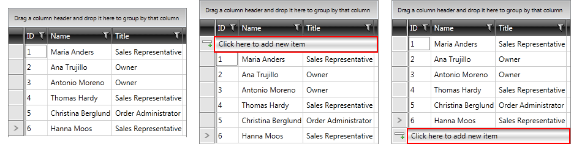
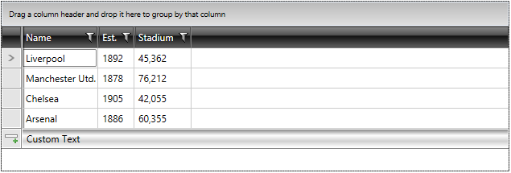

# Adding Rows

Adding new items in the __RadGridView__ is done via the __GridViewNewRow__ control. It appears in the form of an empty row and allows you to enter a value for the field of each column.

#### __Figure 1: Default appearance of GridViewNewRow__


__RadGridView__ gives you the ability to make the newly inserted row visible. Also you can control its position. In order to enable this feature, you should set __RadGridView__'s __NewRowPosition__ property. It has three options:
        
* __None__:  Do not display the new row.        
* __Top__: Display the new row on top.          
* __Bottom__: Display the new row at the bottom after the last standard row. Please note that this mode is supported only when __GroupRenderMode__ is __Flat__.

__Setting the new row position__
```XAML
	<telerik:RadGridView NewRowPosition="Top" />
```
 
#### __Figure 2: Different positions of GridViewNewRow__


> As of Q3 2013 the __ShowInsertRow__ property is marked as __Obsolete__. Instead of it, you can use __NewRowPosition__ property.
        
>tip You can have an always visible new row by setting __NewRowPosition__ property of __RadGridView__. Note it will be visible even when the __CanUserInsertRows__ is set to __False__ or the __IsReadOnly__ property is set to __True__, however the user will still not be able to use it.

## Changing the default text of GridViewNewRow

The default text of the __GridViewNewRow__ is *"Click here to add new item"*. However, you can change the content by creating a custom [LocalizationManager](), override the *GetStringOverride* method for the *GridViewAlwaysVisibleNewRow* resource and apply the custom manager to your application. 

__Create custom LocalizationManager class__
```C#
	class CustomLocalizationManager : LocalizationManager
    {
        public override string GetStringOverride(string key)
        {
            switch (key)
            {
                case "GridViewAlwaysVisibleNewRow":
                    return "Custom Text";
            }
            return base.GetStringOverride(key);
           
        }
    }
```
        
__Apply the custom LocalizationManager for your application__
```C#
	 public MainWindow()
        {
            InitializeComponent();
            LocalizationManager.Manager = new CustomLocalizationManager();
        }
```

__Figure 3__ shows the result after the custom LocalizationManager is applied.

#### __Figure 3: Appearance of RadGridView after modifying NewRow`s default text__


To learn more about how to utilize __GridViewNewRow__ take a look at the [Adding New Entries]() topic.
        
## See Also
 * [Customizing Rows]()
 * [Grid Rows - Overview]()
 * [Cannot Insert New Row]()
