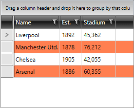

# Alternating Rows

__RadGridView__ allows you to have alternating rows should you need to improve readability. 

In order to define the pattern of alternation, you have to set the __AlternationCount__ property. For example, if you want to alternate each second row, you have to set its value to __2__. Setting the __AlternationCount__ property to __3__ shows an alternating color for each third row.

__Example 1: Setting the AlternationCount Property__

```XAML
	<telerik:RadGridView AlternationCount="2" />
```


In order to style the alternating rows, you can specify the __AlternateRowStyle__ and/or the __AlternateRowBackground__ properties. If you do not specify an AlternateRowBackground a default color will be picked, based on the current theme.

>tip To learn more about styling the rows and the alternating rows you can read [the following article]().

__Example 2__ shows __RadGridView__ with __AlternationCount__ set to __2__ and __AlternateRowBackground__ color set to __Coral__.

__Example 2: Setting the AlternateRowBackground Property__
```XAML
	<telerik:RadGridView AlternationCount="2"
	                   AlternateRowBackground="Coral" />
```



## See Also

* [Grid Rows - Overview]()
* [Customizing Rows]()
* [Selected Row Background]()
