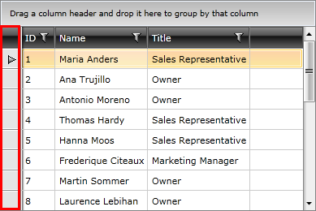
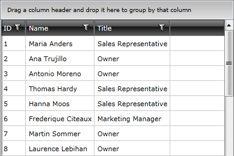

# Hiding the Row Indicator

By default the first cell of a row represents the row indicator area. The indicator appears when the row is set as current.

The row indicator visibility is controlled with the __RowIndicatorVisibility__ property of RadGridView.

#### __[XAML] Example 1: Hiding the row indicator__  
{{region xaml-gridview-customizing-rows_0}}
	<telerik:RadGridView RowIndicatorVisibility="Collapsed" />
{{endregion}}

## Changing Rows Height

To limit the height of the rows, set the __RowHeight__ property of RadGridView. The property affects the rows only if their content is measured with a height smaller or equal to the RowHeight value. Otherwise, the measured size takes precedence.

#### __[XAML] Example 2: Setting RowHeight__  
{{region xaml-gridview-customizing-rows_1}}
	<telerik:RadGridView RowHeight="50" />
{{endregion}}

Additionally, the rows content size can be limited via the __MinHeight__ and __MaxHeight__ properties of the GridViewRow control. To set those, you can use the __RowStyle__ property of RadGridView.

#### __[XAML] Example 3: Setting row's MaxHeight__  
{{region xaml-gridview-customizing-rows_2}}
	<telerik:RadGridView>
		<telerik:RadGridView.RowStyle>
			<!-- If you use NoXaml dlls set the BasedOn property of the Style: BasedOn="{StaticResource GridViewRowStyle}" -->
			
		</telerik:RadGridView.RowStyle>
	</telerik:RadGridView>
{{endregion}}

RadGridView allows you to easily customize each of the row types by just assigning a style to it. 

## Styling Row and Alternating Row

To style rows or alternating rows you can use the __RowStyle__ or the __AlternateRowStyle__ properties. To learn how to do this take a look at the [Styling Rows]() topic.

## Styling the Group Row

To style the group row you can use the __GroupRowStyle__ property. To learn how to do this take a look at the [Styling Group Row]() topic.

## Styling the Header Row

To style the header row you can use the __HeaderRowStyle__ property. To learn how to do this take a look at the [Styling Header Row]() topic.

## See Also

 * [Grid Rows - Overview]()

 * [Adding Rows]()
 
 * [UI Virtualization]()
