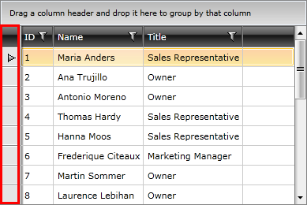
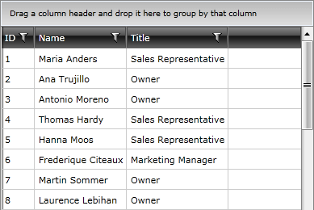

# Hiding the Row Indicator

By default the first cell of a row represents the row indicator area. The indicator appears when the row is set as current.



The row indicator visibility is controlled with the __RowIndicatorVisibility__ property of RadGridView.

__Example 1: Hiding the row indicator__  
```XAML
	<telerik:RadGridView RowIndicatorVisibility="Collapsed" />
```



## Changing Rows Height

To limit the height of the rows, set the __RowHeight__ property of RadGridView. The property affects the rows only if their content is measured with a height smaller or equal to the RowHeight value. Otherwise, the measured size takes precedence.

__Example 2: Setting RowHeight__  
```XAML
	<telerik:RadGridView RowHeight="50" />
```

Additionally, the rows content size can be limited via the __MinHeight__ and __MaxHeight__ properties of the GridViewRow control. To set those, you can use the __RowStyle__ property of RadGridView.

__Example 3: Setting row's MaxHeight__  
```XAML
	<telerik:RadGridView>
		<telerik:RadGridView.RowStyle>
			<!-- If you use NoXaml dlls set the BasedOn property of the Style: BasedOn="{StaticResource GridViewRowStyle}" -->
			<Style TargetType="telerik:GridViewRow">
				<Setter Property="MaxHeight" Value="36" />
			</Style>
		</telerik:RadGridView.RowStyle>
	</telerik:RadGridView>
```

RadGridView allows you to easily customize each of the row types by just assigning a style to it. 

## Styling Row and Alternating Row

To style rows or alternating rows you can use the __RowStyle__ or the __AlternateRowStyle__ properties. To learn how to do this take a look at the [Styling Rows]() topic.

## Styling the Group Row

To style the group row you can use the __GroupRowStyle__ property. To learn how to do this take a look at the [Styling Group Row]() topic.

## Styling the Header Row

To style the header row you can use the __HeaderRowStyle__ property. To learn how to do this take a look at the [Styling Header Row]() topic.

## Displaying a Header Value for Each Row

__GridViewHeaderRow__ represents the single header row that contains the column headers. It does not create a separate header for each data row.

If you want to display a row-specific value at the left side of each data row, add a bound __GridViewDataColumn__ as the first column. Set __LeftFrozenColumnCount__ to __1__ if the column should remain visible while the user scrolls horizontally.

__Example 2: Adding a row-specific header column__  
```XAML
	<telerik:RadGridView ItemsSource="{Binding Items}"
	                     AutoGenerateColumns="False"
	                     LeftFrozenColumnCount="1">
	    <telerik:RadGridView.Columns>
	        <telerik:GridViewDataColumn Header="Row Header"
	                                    DataMemberBinding="{Binding RowHeader}"
	                                    IsReadOnly="True" />
	        <telerik:GridViewDataColumn Header="Name"
	                                    DataMemberBinding="{Binding Name}" />
	    </telerik:RadGridView.Columns>
	</telerik:RadGridView>
```

This approach displays the `RowHeader` property as a regular, bound column. It is the recommended approach when the row header is data from the item.

If you need a separate visual gutter outside the data columns, RadGridView does not expose a documented __RowHeader__ or __GridViewRowHeader__ API. Customize the __GridViewRow__ control template or the applicable theme template instead. Preserve all required template parts when modifying the template. For more information, see [Modifying Default Styles]() and [Styling Overview]().

## See Also

 * [Grid Rows - Overview]()

 * [Adding Rows]()

 * [Defining Columns]()

 * [Frozen Columns]()
 
 * [UI Virtualization]()
