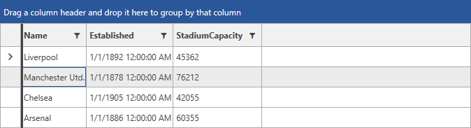
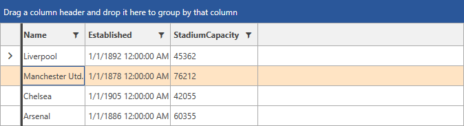
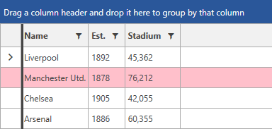

# SelectedBackground and MouseOverBackground

The __GridViewRow__ element exposes properties which allow you to change the default brush used for its selected and mouseover states. Those are __SelectedBackground__ and __MouseOverBackground__.

## SelectedBackground

RadGridView has a default Brush for its selection on row level depending on the given theme. For example, the visual appearance of the selected row in the Office2016 theme would be as shown below.

#### __Figure 1: Selected Row Background in Office2016 Theme__



As of __R3 2018 RadGridView__ provides support for setting the background of its selected rows through the __SelectedBackground__ property of __GridViewRow__.

__Example 1: Setting the SelectedBackground property of GridViewRow__

```XAML
	 <Style TargetType="telerik:GridViewRow">
            <Setter Property="SelectedBackground" Value="Bisque"/>
        </Style>
```

#### __Figure 2: RadGridView with modified Background for its Selected Row__



> If you have [alternating rows]() and you have explicitly set a style which sets the SelectedBackground of the rows to the __RowStyle__ property of the RadGridView, you will have to set the [AlternateRowStyle]() property to the same style (or a style that sets the __SelectedBackground__ property to the same value).

<!-- -->

>tip In case the [SelectionUnit](#selection-units) of the RadGridView is __Cell__ or __Mixed__, you can set the [SelectedBackground](#setting-the-selectedbackground-of-the-cell) property of the __GridViewCell__. 

## MouseOverBackground

As of __R1 2019 SP1__, you are able to change the brush used for the mouseover state of the GridViewRow by setting its __MouseOverBackground__ property as demonstrated in __Example 2__.

__Example 2: Setting the MouseOverBackground property of GridViewRow__

```XAML
	<Style TargetType="telerik:GridViewRow" >
        <Setter Property="MouseOverBackground" Value="Pink" />
    </Style>
```

#### __Figure 2: RadGridView with modified MouseOver Background__



> The notes in the previous section about the __SelectedBackground__ property apply to the __MouseOverBackground__ as well.


## See Also

* [Grid Rows - Overview]()
* [Customizing Rows]()
* [Alternating Rows]()
