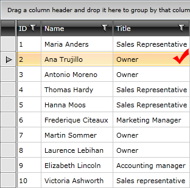
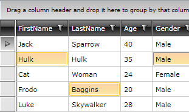

# Basic Selection

__RadGridView__ provides you with selection functionality, which allows the user to select one or more rows and/or cells from the data displayed by the control.

>tip The selection mechanism can be controlled programmatically too. For more information take a look at the [Programmatic Selection]() article.

Users can select an item in through the control's UI by clicking somewhere on the desired row.

#### Figure 1: Row Selection



If enabled, users can also select a single cell or multiple cells as shown in **Figure 2**.

#### Figure 2: Cell Selection



To set the selection unit, use the __SelectionUnit__ enumeration property of the RadGridView. Setting it to __FullRow__ will enable the selection of rows (default) while setting it to __Cell__ will enable the cell selection.

## Selection Modes

The __RadGridView__ control provides three selection modes, which allow you to manipulate the type of selection. This is controlled by the __SelectionMode__ enumeration property which has the following values:

* __Single__: Only one item can be selected at a time. __(default value)__

* __Multiple__: Items are added to the selection when they get clicked and get removed when they get clicked again. 

* __Extended__: Items are added to the selection only by combining the mouse clicks with the __Ctrl__ or __Shift__ keys. 

>tip To learn more about the multiple selections (the __Multiple__ and __Extended__ selection modes) take a look at the [Multiple Selection]() topic.

## Selection Units

__RadGridView__ also provides three selection units, which allow you to manipulate what units are selected when you interact with the grid. This is controlled by the __SelectionUnit__ enumeration property which has the following values:

* __FullRow__: This is the default value. Clicking within the cells will select the whole row.    
* __Cell__: Only the clicked cell is selected. Depending on the value of the __SelectionMode__ property you can have more than one selected cell. 
* __Mixed__: You can select both cells and rows. To select a row you should click either on the **row indicator** or outside any cells in the row.

## Selected items

__RadGridView__ provides several properties to get the data behind the selected items - __SelectedItem__, __SelectedItems__ and __SelectedCells__. 

* __SelectedItem__: The business object corresponding to the selected row. If the **SelectionUnit** is **Cell** or no full rows have been selected, it's value is **null**.
* __SelectedItems__: A collection of the business objects corresponding to the selected rows. If the **SelectionUnit** is **Cell** or no full rows have been selected, the collection is empty.
* __SelectedCells__: A collection of __GridViewCellInfo__ objects which represent the corresponding business object(s) and the column(s) of the selected cell(s).

>important When filtering is applied to the control, if a currently selected item does not pass the filtering criteria, it will be deselected.

## Disabling Selection

To disable the selection functionality you can set the __CanUserSelect__ property to **False**.

>This will only disable the selection. The user will still be able to change the current item.

>This will disable the selection only for the end-user. It will still be possible to manipulate the selection programmatically.
          
__Example 1: Set the CanUserSelect property in XAML__

```XAML
	<telerik:RadGridView x:Name="radGridView"
	                 CanUserSelect="False">
	</telerik:RadGridView>
```

__Example 1: Set the CanUserSelect property in code-behind__

```C#
	this.radGridView.CanUserSelect = false;
```
```VB.NET
	Me.radGridView.CanUserSelect = False
```

## DragElementAction

When the __SelectionMode__ is __Extended__, you can set the __DragElementAction__ property of the RadGridView in order to specify the action that will be taken when the user performs a drag over the GridViewRows. This property is of type [DragAction](https://docs.telerik.com/devtools/wpf/api/telerik.windows.controls.gridview.selection.dragaction) and has the following values:

* __ExtendedSelect__: Performs selection without taking the drag unit selection state.
* __None__: Does not execute any action.
* __Select__: Performs selection. This mode does not perform selection when dragging from a unit that is selected.

## Events

There are five events relevant to the selection functionality in the RadGridView - __SelectionChanging, SelectionChanged, CurrentCellInfoChanged, SelectedCellsChanging and SelectedCellsChanged__. To learn more about each of them go to the [Selection Events]() article.

## See Also

 * [Multiple Selection]()
 * [Programmatic Selection]()
 * [Basic Filtering]()
 * [Programmatic Filtering]()
