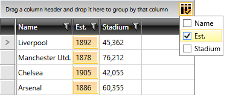

# Column Selection

As of **R3 2016** entire columns can be added to RadGridView's selection. This can be done in any of the following ways:

>important Column selection is only available when **SelectionMode** is either **Multiple** or **Extended** and **SelectionUnit** is either **Cell** or **Mixed**.

## Select Columns Through the UI

RadGridView's new **CanUserSelectColumns** property determines whether users can add a whole column to the current selection. The default value is **False**, but when set to **True**, a new [RadDropDownButton](#raddropdownbutton) appears in RadGridView's  top right corner. When clicked, a **ListBox** appears, whose **ItemsSource** is bound to RadGridView's **Columns** collection. The user can then check and uncheck columns in order to add and remove them from the current selection. 

>Column selection behaves differently depending on the **SelectionMode** - when dealing with **Extended** selection, if you want to select multiple columns, you need to hold down the **Ctrl** key.

__Example 1: Setting RadGridView's CanUserSelectColumns property__  
```C#
	this.radGridView.CanUserSelectColumns = true;
```
```VB.NET
	Me.radGridView.CanUserSelectColumns = True
```

#### __Figure 1: Selecting columns through the UI__  


The __hide column selection button__, set the RadGridView's **ColumnsSelectionButtonVisibility** property.

__Example 2: Setting RadGridView's ColumnsSelectionButtonVisibility property in XAML__  
```XAML
	<telerik:RadGridView CanUserSelectColumns="True" ColumnsSelectionButtonVisibility="Collapsed" />
```

__Example 3: Setting RadGridView's ColumnsSelectionButtonVisibility property in code__  
```C#
	this.radGridView.ColumnsSelectionButtonVisibility = Visibility.Collapsed;
```
```VB.NET
	Me.radGridView.ColumnsSelectionButtonVisibility = Visibility.Collapsed
```

## Select Columns Via a Column's IsSelected Property

Columns can also be selected programmatically by setting their **IsSelected** property.

>Bear in mind that this will only work if **CanUserSelectColumns** is set to **True**. 

__Example 4: Setting a column's IsSelected property__  
```C#
	this.radGridView.Columns["Name"].IsSelected = true;
```
```VB.NET
	Me.radGridView.Columns("Name").IsSelected = True
```

## Using the SelectCellRegion Method

Another way to programmatically select columns is by using the [SelectCellRegion method](#selecting-cell-regions).

__Example 5: Selecting a column with the SelectCellRegion method__  
```C#
	this.radGridView.SelectCellRegion(new CellRegion(this.radGridView.Columns["Name"].DisplayIndex, 0, 1, this.radGridView.Items.Count));
```
```VB.NET
	Me.radGridView.SelectCellRegion(New CellRegion(Me.radGridView.Columns("Name").DisplayIndex, 0, 1, Me.radGridView.Items.Count))
```

## See Also  
 * [Basic Selection]()
 * [Programmatic Selection]()
 * [Basic Filtering]()
 * [Programmatic Filtering]()
 * [Multiple-column Sorting]()
