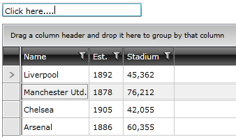
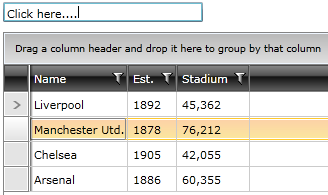

# Stop Showing the Unfocused State

When the `RadGridView` and `RadTreeListView` controls lost the focus, their selected visual items (`GridViewRow` and `TreeListViewRow`) enter an __unfocused__ state which tones down their color (usually the color is changed to light gray). This makes it more clear that the control doesn't have the focus.



To disable this and keep the selection color that is displayed when the control is focused, set the `EnableLostFocusSelectedState` property to `False`.


```XAML
    <telerik:RadGridView EnableLostFocusSelectedState="False"/>
```


