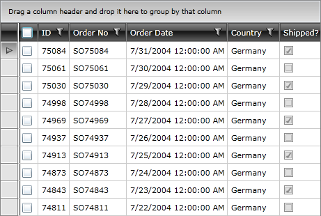

# Selection via CheckBox

The __RadGridView__'s API offers you a __GridViewSelectColumn__, with the help of which you can perform a selection via __CheckBox__. The purpose of this tutorial is to show you how to achieve this behavior.

Here is a __RadGridView__ declaration, which is populated with some sample data.


```XAML
	<telerik:RadGridView x:Name="radGridView"
	                 IsReadOnly="False"
	                 AutoGenerateColumns="False">
	    <telerik:RadGridView.Columns>
	        <telerik:GridViewSelectColumn />
	        <telerik:GridViewDataColumn DataMemberBinding="{Binding Id}"
	                                Header="ID"/>
	        <telerik:GridViewDataColumn DataMemberBinding="{Binding OrderNO, Mode=TwoWay}"
	                                Header="Order No">
	        </telerik:GridViewDataColumn>
	        <telerik:GridViewDataColumn DataMemberBinding="{Binding OrderDate, Mode=TwoWay}"
	                                Header="Order Date">
	        </telerik:GridViewDataColumn>
	        <telerik:GridViewDataColumn DataMemberBinding="{Binding Country, Mode=TwoWay}"
	                                Header="Country">
	        </telerik:GridViewDataColumn>
	        <telerik:GridViewDataColumn DataMemberBinding="{Binding Shipped, Mode=TwoWay}"
	                                Header="Shipped?">
	        </telerik:GridViewDataColumn>
	    </telerik:RadGridView.Columns>
	</telerik:RadGridView>
```

The grid is shown on the next figure.



In order to enable the selection via checkbox behavior, you need to perform the following instructions:

1. Enable __multiple selection__ for the __RadGridView__.


```XAML
	<telerik:RadGridView SelectionMode="Extended">
```

2. Add an additional __GridViewColumn__ of type __GridViewSelectColumn__.


```XAML
	<telerik:RadGridView.Columns>
	    <telerik:GridViewSelectColumn/>
	    <!--...-->
	</telerik:RadGridView.Columns>
	</telerik:RadGridView>
```

Here is the final result. When you select the CheckBox Header, then all rows will be automatically selected.


>tipWhen you want to use selection via checkbox, then:1. Set the __SelectionMode__ property to __Extended__ or __Multiple__. Leaving it to __Single__ you won't be able to select all of the entries in the __RadGridView__.2. Add a __GridViewSelectColumn__.

>tipIf you need further information for the __GridViewSelectColumn__ and all other provided columns take a look at the [this topic]().
