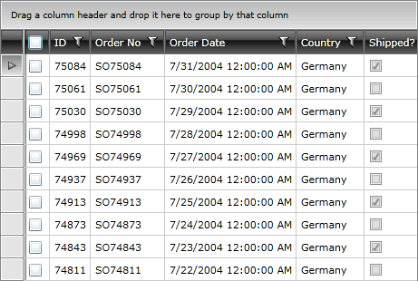
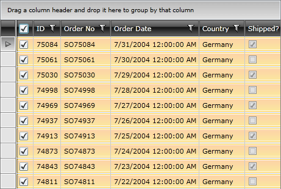

# Selection via CheckBox

The __RadGridView__'s API offers you a __GridViewSelectColumn__, with the help of which you can perform a selection via __CheckBox__. The purpose of this tutorial is to show you how to achieve this behavior.

Here is a __RadGridView__ declaration, which is populated with some sample data.

<snippet id='radgridview-selection-how-to-via-checkbox-block_1-xaml' />

The grid is shown on the next figure.

In order to enable the selection via checkbox behavior, you need to perform the following instructions:

1. Enable __multiple selection__ for the __RadGridView__.

<snippet id='radgridview-selection-how-to-via-checkbox-block_2-xaml' />

2. Add an additional __GridViewColumn__ of type __GridViewSelectColumn__.

<snippet id='radgridview-selection-how-to-via-checkbox-block_3-xaml' />

Here is the final result. When you select the CheckBox Header, then all rows will be automatically selected.

>tip When you want to use selection via checkbox, then:1. Set the __SelectionMode__ property to __Extended__ or __Multiple__. Leaving it to __Single__ you won't be able to select all of the entries in the __RadGridView__.2. Add a __GridViewSelectColumn__.

>tip If you need further information for the __GridViewSelectColumn__ and all other provided columns take a look at the [this topic]().
