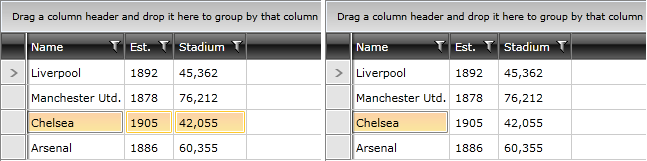
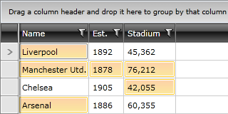
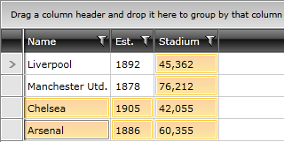

# {{ site.framework_name }} RadGridView Mixed Selection

__RadGridView__ allows the user to select a cell or a row. By default this functionality is disabled and to turn it on you have to set the __SelectionUnit__ property to __Mixed__.

>In order to select a full row when the SelectionUnit is Mixed, you can click somewhere on it outside of its cells.

## SelectionMode and SelectionUnit

RadGridView provides three selection modes, which allow you to manipulate the type of selection. The following bullets describe the results when they are combined with SelectionUnit - Mixed:   

* __SelectionMode - Single__: You can select only one unit at a time.             

    
            
* __SelectionMode - Multiple__: You are able to select any cell and any row. Units are added to the selection when they are clicked and get removed when they are clicked again.

    
       
* __SelectionMode - Extended__: Units are added to the selection only by combining the mouse clicks with the __Ctrl__ or __Shift__ key.

    
            
> For more information take a look at the [Basic Selection]() topic.

## See Also

 * [Basic Selection]()

 * [Programmatic Selection]()

 * [Copying]()

 * [Basic Filtering]()

 * [Programmatic Filtering]()

 * [Multiple-column Sorting]()