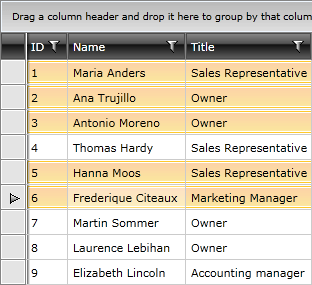
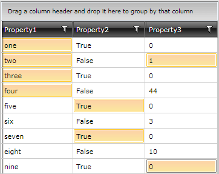

# Multiple Selection

The __RadGridView__ allows the user to select more than one item from the displayed data. By default this functionality is disabled and to turn it on you have to set the __SelectionMode__ property to either __Multiple__ or __Extended__.

#### __XAML__

{{region gridview-multiple-selection_0}}

	<telerik:RadGridView x:Name="radGridView"
	                     SelectionMode="Extended">
	    ...
	</telerik:RadGridView>
{{endregion}}

#### __C#__

{{region gridview-multiple-selection_1}}

	this.radGridView.SelectionMode = System.Windows.Controls.SelectionMode.Extended;
{{endregion}}

#### __VB.NET__

{{region gridview-multiple-selection_2}}

	Me.radGridView.SelectionMode = System.Windows.Controls.SelectionMode.Extended
{{endregion}}

Users will be able to select multiple records using the common key modifiers - __Shift__ and __Ctrl__. Hold __Shift__ to select a range of grid rows - click on the first one and holding the __Shift__ key, click on the last row in the range. __RadGridView__ will select all rows between those two. You can select a set of grid rows (not necessarily neighboring). Hold the __Ctrl__ key and click on the rows which you want to be selected. The same rules apply to the cells if the [SelectionUnit]() property is set to __Cell__.

>tipPressing __Ctrl+A__ will select all items.

>The __Multiple__ value of the __SelectionMode__ enumerator allows the user to add an item to the selection just by clicking on it. It will be removed when it gets clicked again.

You can access all selected rows (or data items) through the __SelectedItems__ collection and all the selected cells through the __SelectedCells__ collection. The following example demonstrates how to bind a __ListBox__ to the selected items of a grid:

#### __XAML__

{{region gridview-multiple-selection_3}}

	<ListBox x:Name="listBoxSelectedItems"
	         DisplayMemberPath="Name"
	         ItemsSource="{Binding SelectedItems, ElementName=radGridView}" />
{{endregion}}

#### __C#__

{{region gridview-multiple-selection_4}}

	listBoxSelectedItems.ItemsSource = this.radGridView.SelectedItems;
{{endregion}}

#### __VB.NET__

{{region gridview-multiple-selection_5}}

	listBoxSelectedItems.ItemsSource = Me.radGridView.SelectedItems
{{endregion}}

>When multiple items are selected the __SelectedItem__ property has as value the first selected one.

# See Also

 * [Basic Selection]()

 * [Programmatic Selection]()

 * [Basic Filtering]()

 * [Programmatic Filtering]()

 * [Multiple-column Sorting]()
