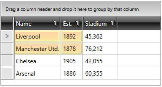
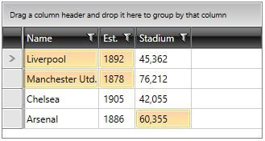

# Programmatic Selection

Besides the built-in selection functionality, you are able to use a programmatic approach to select the data in the __RadGridView__. The __RadGridView__ exposes several properties that allow you to manipulate the selected data.
        
## SelectedItem

To access the data item of the selected row use the __SelectedItem__ property. It changes its value every time when the row selection changes and exposes the object to which the row is bound. You can use it when the __SelectionUnit__ is set to __FullRow__ (default), otherwise it is null.

__Example 1: Accessing RadGridView's selected item__

```C#
	Employee e = this.radGridView.SelectedItem as Employee;
```
```VB.NET
	Dim e As Employee = TryCast(Me.radGridView.SelectedItem, Employee)
```

You can also set the __SelectedItem__ to an item in the __RadGridView's__ data source and it will get automatically selected. For example, if you want on a certain action the first item in your __RadGridView__ to be selected, you can do the following.

__Example 2: Setting the SelectedItem to an item of the ItemsSource__

```C#
	this.radGridView.SelectedItem = ((ObservableCollection<Employee>)this.radGridView.ItemsSource).First();
```
```VB.NET
	Me.radGridView.SelectedItem = CType(Me.radGridView.ItemsSource, ObservableCollection(Of Employee)).First()
```

When choosing this approach, you need to make sure that the data is already loaded. (e.g. you can use the above code in the __DataLoaded__ event of the RadGridView)

>tipYou can also make another control like __ListBox__ or __ComboBox__ to pass the __SelectedItem__ to the __RadGridView__. 

## CurrentItem

The __CurrentItem__ property of the RadGridView corresponds to the CurrentItem of the bound ICollectionView. It may or may not coincide with the selected row. However, in most of the cases these two rows are one and the same.

You can also set the __CurrentItem__ to an item in the __RadGridView's__ data source and it will get automatically selected. For example, if you want on a certain action the first item in your __RadGridView__ to be current you can do the following.

__Example 3: Setting the CurrentItem__

```C#
	this.radGridView.CurrentItem = ((ObservableCollection<Employee>)this.radGridView.ItemsSource).First();
```
```VB.NET
	Me.radGridView.CurrentItem = CType(Me.radGridView.ItemsSource, ObservableCollection(Of Employee)).First()
```

>tipYou can also make another control like __ListBox__ or __ComboBox__ to pass the __CurrentItem__ to the __RadGridView__.

>Prior to R2 2010 version, the current item was synchronized with the selected item. As a result, the __first row__ of the GridView was __selected initially__. To prevent this, you would simply need to set the __IsSynchronizedWithCurrentItem__ property of RadGridView to __False__. In __R2 2010__ version, the __IsSynchronizedWithCurrentItem__ is null by default - SelectedItem is synchronized with the CurrentItem only if CollectionView is used as ItemsSource

## SelectedItems

The __SelectedItems__ is a collection of data items, which holds the currently selected items. As it is a collection you can get, add and remove items from it. In this way you can easily manipulate the selection, e.g. selecting and deselecting items on certain criteria. You can use it when the __SelectionUnit__ is set to __FullRow__ (default), otherwise it is null. It will contain more than one item when the __SelectionMode__ is either __Multiple__ or __Extended__. 

>If the selection mode is set to __Single__ it will always hold at most one item.

__Example 4: Adding/deselecting an item__

```C#
	this.radGridView.SelectedItems.Add(itemToSelect);
	this.radGridView.SelectedItems.Remove(itemToDeselect);
```
```VB.NET
	Me.radGridView.SelectedItems.Add(itemToSelect)
	Me.radGridView.SelectedItems.Remove(itemToDeselect)
```

>If you add more than one item in the __SelectedItems__ while the selection mode is single, the selection will disappear. Consider working with the collection only when you are using __Multiple__ or __Extended__ selection mode.

>You can add or remove items to the __SelectedItems__ collection, but cannot change its instance because it is read only.

>tip Find a runnable project showing how to bind the __SelectedItems__ collection of the RadGridView to a property in your ViewModel in the [SDK examples GitHub repository](https://github.com/telerik/xaml-sdk/tree/master/GridView/BindingSelectedItemsFromViewModel).

## SelectedCells

Represents a collection of __GridViewCellInfo__ objects which represent the business object and the column of the selected cell/cells. You can work with it when the __SelectionUnit__ is set to __Cell__, otherwise it will be null.

__Example 5: Adding/removing cells from SelectedCells collection__

```C#
	this.radGridView.SelectedCells.Add(new GridViewCellInfo(item, column, this.radGridView));
	this.radGridView.SelectedCells.Remove(new GridViewCellInfo(item, column, this.radGridView));
```
```VB.NET
	Me.radGridView.SelectedCells.Add(New GridViewCellInfo(item, column, Me.radGridView))
	Me.radGridView.SelectedCells.Remove(New GridViewCellInfo(item, column, Me.radGridView))
```

## Select Method

You can also select items by using the **Select** method which accepts a collection of items. This is a lot quicker than calling the **SelectedItems.Add()** method for each item.

__Example 6: Selecting items__

```C#
	this.radGridView.Select(itemsToSelect);
```
```VB.NET
	Me.radGridView.Select(itemsToSelect)
```

## Selecting All Items

The __RadGridView__ control also exposes a __SelectAll()__ method, which allows you to select all items at once.

__Example 7: Selecting all items__

```C#
	this.radGridView.SelectAll();
```
```VB.NET
	Me.radGridView.SelectAll()
```

## Deselecting All Items

There are two ways to remove the selection. The first one is to set the __SelectedItem__ property to null.

__Example 8: Deselecting by setting SelectedItem to null__

```C#
	this.radGridView.SelectedItem = null;
```
```VB.NET
	Me.radGridView.SelectedItem = Nothing
```

The second one is to call the __Clear()__ method of the __SelectedItems__ collection.

__Example 9: Calling SelectedItem's Clear method__

```C#
	this.radGridView.SelectedItems.Clear();
```
```VB.NET
	Me.radGridView.SelectedItems.Clear()
```

## Selecting Cell Regions

As of **R3 2016** RadGridView exposes a **SelectCellRegion** method which allows you to select specific region(s) of cells. Its overloads allow you to pass as a parameter either a single **CellRegion** instance or a collection of cell regions. The CellRegion class has a single constructor through which you can set the following internal properties:

* **Left**: The horizontal offset for the top-left cell.

* **Top**: The vertical offset for the top-left cell.

* **Width**: The number of cells to select horizontally.

* **Height**: The number of cells to select vertically.

__Example 10: Selecting а single cell region__

```C#

	this.radGridView.SelectCellRegion(new CellRegion(0, 0, 2, 2));
```
```VB.NET

	Me.radGridView.SelectCellRegion(New CellRegion(0, 0, 2, 2))
```

#### __Figure 1: The selected region__



__Example 11: Selecting multiple cell regions__

```C#

	this.radGridView.SelectCellRegion(new List<CellRegion>()
    {
        new CellRegion(0, 0, 2, 2),
        new CellRegion(2, 3, 1, 1)
    });
```
```VB.NET

	Me.radGridView.SelectCellRegion(New List(Of CellRegion)() From {
		New CellRegion(0, 0, 2, 2),
		New CellRegion(2, 3, 1, 1)
	})
```

#### __Figure 2: The selected regions__



## Deselecting cell regions

You can deselect cell regions by using RadGridView's **UnselectCellRegion** method similarly to using [SelectCellRegion](#selecting-cell-regions).

## Selecting range of items

>To enable this functionality, the __SelectionMode__ needs to be set either to __Multiple__, or to __Extended__.

__RadGridView__ exposes a mechanism for a fast programmatic selection of a range of items. The method for utilizing it is the __SelectItemsRange__. It is available with the __2017.3.1120 latest internal build__ and the official version that is going to support it is __R1 2018__. The method exposes two overloads:

* __SelectItemsRange(int startIndex, int endIndex)__: Selects items in a given range by specified indexes.

* __SelectItemsRange(object startItem, object endItem)__: Selects items in a given range by specified object instances.

>Deselecting items when using the __SelectItemsRange__ needs to be performed through removing items from the __SelectedItems__ collection of __RadGridView__


## See Also

 * [Basic Selection]()

 * [Multiple Selection]()

 * [Programmatic Filtering]()

 * [Programmatic Sorting]()
