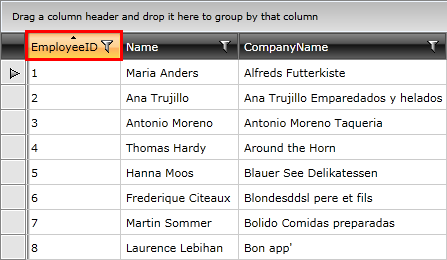

# Basic Sorting

__RadGridView__ provides you with a built-in sorting functionality, which allows the user to easily sort the data by one or several columns. 

This article is divided into the following topics:

* [Overview](#overview)
* [SortMemberPath](#sortmemberpath)
* [Disable Sorting](#disable-sorting)
* [Events](#events)
	* [Sorting](#sorting)
	* [Sorted](#sorted)
* [Style the Sorted Header](#style-the-sorted-header)

## Overview

The data gets sorted as the user clicks the header of a column. When sorted you should see the header of the column highlighted and the appropriate arrow showing if the applied sorting is ascending or descending.

#### Figure 1: RadGridView with applied sorting



By clicking on the header a second time, the sort direction is changed to descending and on the next click, the sorting will be cleared. The header goes into its normal state and the arrow disappears.
        
>Sorting is a data operation and it is performed by building and executing a LINQ query over the source collection.
>
>If the RadGridView is bound to a collection that inherits __ICollectionView__ that has a __CanSort__ property set to __True__, the RadGridView's sorting is disabled and the sorting mechanism of the collection is used instead.

## SortMemberPath

You can set the __SortMemberPath__ property of a column to specify the name of the property the data in the column will be sorted by. Use this if you need to sort the column by a property different than the one it is bound to.

__Example 1: Specify SortMemberPath__

```XAML
	<telerik:GridViewDataColumn DataMemberBinding="{Binding CompanyName}" SortMemberPath="Name" />
```

## Disable Sorting

If you don't want your __RadGridView__ to be sortable, you just have to set its __CanUserSortColumns__ property to __False__:

__Example 2: Disable sorting__

```XAML
	<telerik:RadGridView CanUserSortColumns="False" />
```

In case you want to disable sorting for a particular column only, you can set that column's __IsSortable__ property to __False__:

__Example 3: Disable sorting for a particular column__

```XAML
	<telerik:GridViewColumn IsSortable="False" />
```

## Events

There are two events that are raised as the user apply sorting on any column. The first one is the __Sorting__ event and it is raised before the data is sorted. The second one is the __Sorted__ event and it is raised after the data is sorted.

__Example 4: Handle the Sorting and Sorted events__

```XAML
	<telerik:RadGridView Sorting="radGridView_Sorting" 
	             Sorted="radGridView_Sorted" />
```

### Sorting

The __GridViewSortingEventArgs__ of the __Sorting__ event provide you with the following properties:

* **Cancel**: A boolean property indicating whether the sorting operation should be canceled.
* **Column**: The **GridViewColumn** that is being sorted.
* **DataControl**: The instance of the **GridViewDataControl** that owns the column. 
* **OldSortingState**: The old **SortingState**. 
* **NewSortingState**: The new **SortingState**.
* **IsMultipleColumnSorting**: The a boolean value indicating whether the current sorting operation is a multiple column. You can check the [Multiple-column Sorting]() article for more information.

__Example 5: Cancel the sorting of a column__

```C#
	private void radGridView_Sorting(object sender, GridViewSortingEventArgs e)
	{
	    e.Cancel = true;
	}
```
```VB.NET
	Private Sub radGridView_Sorting(ByVal sender As Object, ByVal e As GridViewSortingEventArgs)
	    e.Cancel = True
	End Sub
```

> To learn how to use the __Sorting__ event to overwrite the built-in sorting functionality take a look at the [Custom Sorting]() topic.

### Sorted

The __Sorted__ event allows you to get the instance of the column by which the data is sorted via its __GridViewSortedEventArgs__.

In the event handler, you can place some code that has to be executed when the data in the __RadGridView__ gets sorted. For example, you can change the [TextAlignment](#text-properties) of the sorted column:

__Example 7: Change the TextAlignment of the sorted column__

```C#
	private GridViewColumn previousColumn;
	private void radGridView_Sorted(object sender, GridViewSortedEventArgs e)
	{
	    if (this.previousColumn != null)
	    {
	        this.previousColumn.TextAlignment = TextAlignment.Left;
	    }

	    e.Column.TextAlignment = TextAlignment.Right;
	    this.previousColumn = e.Column;
	}
```
```VB.NET
	Private previousColumn As GridViewColumn
	Private Sub radGridView_Sorted(ByVal sender As Object, ByVal e As GridViewSortedEventArgs)
		If Me.previousColumn IsNot Nothing Then
			Me.previousColumn.TextAlignment = TextAlignment.Left
		End If

		e.Column.TextAlignment = TextAlignment.Right
		Me.previousColumn = e.Column
	End Sub
```

> In this example, the **previousColumn** field is used to store the currently sorted column. This is done in order to revert its TextAlignment color when another column is selected. 

## Style the Sorted Header

By [editing the template]() of the header cell, you are able to change its overall look and feel. Making use of the **VisualStateManager** also allows you to adjust the visual appearance in the different sorting states - descending, ascending and none. You can also change the visual element that represents the direction of the sorting. For more information, have a look at the [Styling Column Headers]() article.

## See Also

 * [Programmatic Sorting]()
 * [Set SortingState on Column]()
 * [Custom Sorting]()
 * [Multiple-column Sorting]()
 * [Reevaluation of data operations]()
 * [Styling Column Headers]()
