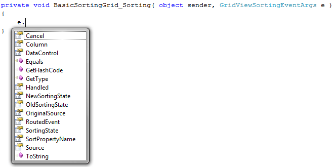
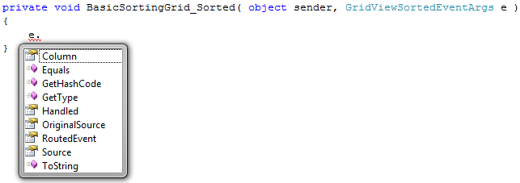
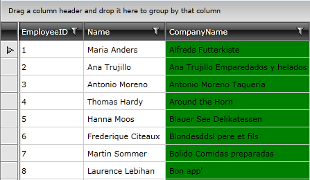

# Basic Sorting

Through __SortingState__ property, __RadGridView__ provides you with a built-in sorting functionality, which allows the user to easily sort the data by one or several columns. The data can be sorted in three ways:

* __Ascending__
* __Descending__
* __No Sort__

>tip __SortingState__ property does not have sorting functionality. It just determines the way the data would be sorted.

>tipRadGridView allows __multi column sorting__. You can check [this topic]() for more information.
        

>Sorting is a data operation and it is performed by building and executing a LINQ query over the source collection.
>
>If the RadGridView is bound to a collection that inherits __ICollectionView__ that has a __CanSort__ property set to __true__, the RadGridView`s sorting is disabled and the sorting mechanism of the collection is used instead.

The data gets sorted as the user clicks the header of a column. When sorted you should see the header of the column highlighted and the appropriate arrow showing if the applied sorting is ascending or descending.

By clicking on the header a second time the sort direction is changed to descending and on the next click the sorting will be cleared. The header goes into its normal state and the arrow disappears.

>You can set the __SortMemberPath__ property of the column to specify the name of the property the data in the column will be sorted by.
        

## Disabling Sorting

If you don't want your __RadGridView__ to be sortable, you just have to set its __CanUserSortColumns__ property to __False__:

#### __XAML__

{{region gridview-sorting-basics_0}}

	<telerik:RadGridView x:Name="radGridView" 
	                     CanUserSortColumns="False">
	</telerik:RadGridView>
{{endregion}}

In case you want to disable sorting for a particular column only, you can configure column's __IsSortable__ property to __False__:

#### __XAML__

{{region gridview-sorting-basics_1}}

	<telerik:GridViewColumn IsSortable="False" />
{{endregion}}

## Events

There are two events that are raised as the user apply sorting on any column. The first one is the __Sorting__ event and it is raised before the data is sorted. The second one is the __Sorted__ event and it is raised after the data is sorted.

#### __XAML__

{{region gridview-sorting-basics_2}}

	<telerik:RadGridView x:Name="radGridView"
                         Sorting="radGridView_Sorting"
                         Sorted="radGridView_Sorted" />
{{endregion}}

Via the __GridViewSortingEventArgs__ of the __Sorting__ event you can get the instance of the column that is being sorted (__e.Column__), the instance of the __RadGridView__ that owns the column (__e.DataControl__), the sorting state (__e.SortingState__) and others. 

You are also able to cancel the sorting operation by setting the __e.Cancel__ property to __True__.

#### __C#__

{{region gridview-sorting-basics_3}}

	private void radGridView_Sorting( object sender, GridViewSortingEventArgs e )
	{
	    e.Cancel = true;
	}
{{endregion}}

#### __VB.NET__

{{region gridview-sorting-basics_4}}

	Private Sub radGridView_Sorting(ByVal sender As Object, ByVal e As GridViewSortingEventArgs)
	    e.Cancel = True
	End Sub
{{endregion}}

To learn how to use the __Sorting__ event to overwrite the built-in sorting functionality take a look at the [Custom Sorting]() topic.

The __Sorted__ event allows you to get an instance of the column by which the data is sorted via its __GridViewSortedEventArgs__:

In the event handler you can place some code that has to be executed when the data in the __RadGridView__ gets sorted. For example, you can change the background color of the sorted column:

#### __C#__

{{region gridview-sorting-basics_5}}

	private GridViewColumn previousColumn;
	private void radGridView_Sorted( object sender, GridViewSortedEventArgs e )
	{
	    if ( this.previousColumn != null )
	    {
	         this.previousColumn.Background = new SolidColorBrush( Colors.Transparent );
	    }
	    e.Column.Background = new SolidColorBrush( Colors.Green );
	    this.previousColumn = e.Column;
	}
{{endregion}}

#### __VB.NET__

{{region gridview-sorting-basics_6}}

	Private previousColumn As GridViewColumn
	Private Sub radGridView_Sorted(ByVal sender As Object, ByVal e As GridViewSortedEventArgs)
	    If Me.previousColumn IsNot Nothing Then
	        Me.previousColumn.Background = New SolidColorBrush(Colors.Transparent)
	    End If
	
	    e.Column.Background = New SolidColorBrush(Colors.Green)
	    Me.previousColumn = e.Column
	End Sub
{{endregion}}

In this example, the previous column field is used to store the currently sorted column. This is done in order to revert its background color when another column is selected. 

Here is a snapshot of the final result.

## Styling the Sorted Header

By editing the template of the header cell you are able to change its overall look and feeling. Making use of the VisualStateManager also allows you to adjust the visual behavior according to the actions of the user - sorted descending or ascending etc. You can also change the visual element that represents the direction of the sorting. To learn more about how to do that take a look at the [Templating the Column Headers]() topic.

# See Also

 * [RadGridView Overview]()

 * [Programmatic Sorting]()

 * [Custom Sorting]()

 * [Multiple-column Sorting]()

 * [Reevaluation of data operations]()
