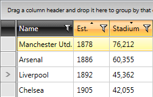
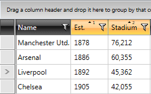

# Multiple-Column Sorting

The `RadGridView` control allows you to sort multiple columns. To do this at run-time, hold the __Shift__ key when clicking on the column headers. To change this, refer to the [Specify Multiple-Column Sorting Modifier Keys](#specify-multiple-column-sorting-modifier-keys) section of this article.

On the snapshot below, the data in RadGridView is sorted ascending by the Est. column and then sorted again by the Stadium column, without removing the previous sorting.
       

To learn how to implement programmatic sorting in your RadGridView, read on this [article]().

## Column Sort Sequence Indicator

The RadGridView control allows you to display sequence indicators for the sorting operations. To enable this, set the `ShowColumnSortIndexes` property of RadGridView to __True__. 

You can check how the column headers will look like after the user has sorted on multiple columns.

## Specify Multiple-Column Sorting Modifier Keys

RadGridView provides the option to specify the modifier keys when performing multi-column sorting. This is done via the `MultipleColumnSortModifiers` property of RadGridView and it is of the type of [ModifierKeys](https://learn.microsoft.com/en-us/dotnet/api/system.windows.input.modifierkeys?view=windowsdesktop-8.0). The default value of the MultipleColumnSortModifiers property is `ModifierKeys.Shift`.

#### __[XAML] Changing the modifier key for the multi-column sorting__
{{region gridview-multiple-column-sorting-0}}
    <telerik:RadGridView ItemsSource="{Binding Clubs}" MultipleColumnSortModifiers="Ctrl"/>
{{endregion}}

## See Also
 * [RadGridView Overview]()
 * [Basic Sorting]()
 * [Programmatic Sorting]()
 * [Custom Sorting]()