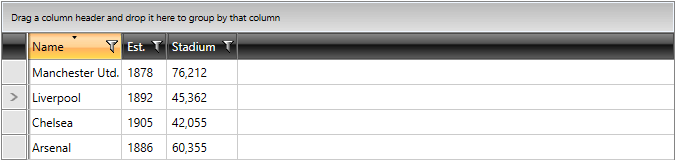
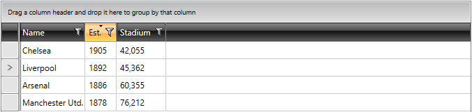

# Programmatic Sorting

Besides the built-in sorting functionality, you are able to programmatically sort the data in __RadGridView__ using the __SortDescriptors__ collection. This collection of __ISortDescriptor__ objects allows you to use descriptors that define the sorting property (or column) and the sorting direction for the bound data. Because this is a collection, you are able not only to add, but you can also remove or clear the entries.
    
>tip If you use __ICollectionView__ as data source, RadGridView will automatically synchronize the __SortDescriptors__ of the source with its own ones.

>As of Q3 2010, RadGridView adds/removes __ColumnSortDescriptor__ to its __SortDescriptors__ collection when the user sorts from the UI.

>You can set the __SortMemberPath__ property of the column to specify the name of the property the data in the column will be sorted by (applies to __ColumnSortDescriptor__ only).

When you add a new descriptor to the collection, the data is automatically sorted according to it. To learn how to create and configure descriptors, look at the following example:


```C#
	ColumnSortDescriptor csd = new ColumnSortDescriptor()
	{
	    Column = this.clubsGrid.Columns["Name"],
	    SortDirection = ListSortDirection.Descending
	};
	this.clubsGrid.SortDescriptors.Add(csd);
```
```VB.NET

	Dim csd As New ColumnSortDescriptor() With { _
	 .Column = Me.clubsGrid.Columns("Name"), _
	 .SortDirection = ListSortDirection.Descending _
	}
	Me.clubsGrid.SortDescriptors.Add(csd)
```

FIGURE 1: Programmatically sorted RadGridView:

      
Another approach is to add the new __SortDescriptor__ object (instead of __ColumnSortDescriptor__) to the RadGridView.SortDescriptors collection:


```C#
	SortDescriptor descriptor = new SortDescriptor();
	descriptor.Member = "Title";
	descriptor.SortDirection = ListSortDirection.Ascending;
```


```VB.NET
	Dim descriptor As New SortDescriptor()
	descriptor.Member = "Title"
	descriptor.SortDirection = ListSortDirection.Ascending
```

The __Member__ property defines the property by which the data will be sorted.
The __SortDirection__ property allows you to define the sorting direction.

>When __SortMemberPath__ is specified, you should apply __ColumnSortDescriptor__ so that the information from the __SortMemberPath__ is respected.
      
You can easily create a sort descriptor in XAML and then add it to the SortDescriptors collection.
For example:


```XAML
	<telerik:RadGridView x:Name="radGridView"
	             AutoGenerateColumns="False">
	
	    <telerik:RadGridView.SortDescriptors>
	        <telerik:SortDescriptor Member="Title"
	                        SortDirection="Ascending" />
	    </telerik:RadGridView.SortDescriptors>
	</telerik:RadGridView>
```

As of __Q3 2011__, you can create a ColumnSortDescriptor in XAML and then add it to the SortDescriptors collection.
      
For example:

```XAML
	<telerik:RadGridView x:Name="clubsGrid" 
	                AutoGenerateColumns="False">
	    <telerik:RadGridView.Columns>
	
	    </telerik:RadGridView.Columns>
	    <telerik:RadGridView.SortDescriptors>
	        <telerik:ColumnSortDescriptor Column="{Binding Columns[\Title\], ElementName=clubsGrid}" SortDirection="Ascending"/>
	    </telerik:RadGridView.SortDescriptors>
	</telerik:RadGridView>
```

### XAML Tip

>tip In case of a static data structure, known during design time, it is better to declare your default sorting in XAML, rather than in your code-behind.

After the application runs with this descriptor defined, __RadGridView__ data will be sorted ascending by the __Title__ column and will look as if the user clicked on the __Title__ column header.
        
>Adding or removing descriptors from the __SortDescriptors__ collection won't raise __Sorting__ and __Sorted__ events, although the data will be sorted.

>The built-in sorting also uses the __SortDescriptors__ collection. When a header is clicked, it clears the __SortDescriptors__ collection and adds a new __ColumnSortDescriptor__ to it.

>tip You are able to add __SortDescriptors/ColumnSortDescriptor__ in XAML only at design time. 
>tip When implementing multi-column sorting behavior you have to manage the __SortDescriptors__ collection at runtime. To learn more, look at the [Multi-column Sorting]() topic.

## Clearing the SortDescriptors Collection of the RadGridView ##

If you need to apply multiple sorting operations and you would like to reset all sorting rules applied, the __SortDescriptors__ collection of the RadGridView should be cleared. 

Consider the following scenario. You apply a programmatic sorting for your RadGridView as follows:


```C#
	ColumnSortDescriptor csd = new ColumnSortDescriptor();
	clubsGrid.SortDescriptors.Clear();
	csd.Column = clubsGrid.Columns["Name"];
	csd.SortDirection = ListSortDirection.Descending;
	clubsGrid.SortDescriptors.Add(csd);
```
```VB.NET
	Dim csd As New ColumnSortDescriptor()
	clubsGrid.SortDescriptors.Clear()
	csd.Column = clubsGrid.Columns("Name")
	csd.SortDirection = ListSortDirection.Descending
	clubsGrid.SortDescriptors.Add(csd)
```

At this point, the RadGridView has the following state:

FIGURE 3:


Eventually, you need to sort the grid by another column and would like to remove the previously applied rule. Use the following approach:


```C#
	ColumnSortDescriptor csd = new ColumnSortDescriptor();
	clubsGrid.SortDescriptors.Clear();
	csd.Column = clubsGrid.Columns["Established"];
	csd.SortDirection = ListSortDirection.Descending;
	clubsGrid.SortDescriptors.Add(csd);
```
```VB.NET
	Dim csd As New ColumnSortDescriptor()
	clubsGrid.SortDescriptors.Clear()
	csd.Column = clubsGrid.Columns("Established")
	csd.SortDirection = ListSortDirection.Descending
	clubsGrid.SortDescriptors.Add(csd)
```

The result will be:

FIGURE 4:


## See Also
 * [Basic Sorting]()
 * [Custom Sorting]()
 * [Multiple-column Sorting]()
