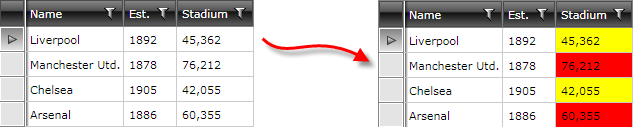

# CellStyleSelector

This article shows how to style RadGridView's cells conditionally by applying __CellStyleSelector__.

>tip To download a runnable project with the example from this article, visit [our SDK repository](https://github.com/telerik/xaml-sdk/). You can find the example in the __GridView/CellStyleSelector__ folder.

> The `CellStyle` property of the column has a higher priority than `CellStyleSelector`. This means, if the `CellStyle` is set, the `CellStyleSelector` won't be invoked.

Assume we have RadGridView bound to a collection of sports clubs. Each club has a __StadiumCapacity__ property. What we want to achieve is to set the background color of the StadiumCapacity cells to __Red if the capacity > 50 000 or Yellow if the capacity < 50 000__:

#### __Figure 1: The expected result__



Follow these steps to configure __CellStyleSelector__:

1. Create a new class that inherits the __StyleSelector__ class.

2. Override its default __SelectStyle__ method. Return the style that will be applied to the framework element (GridViewCell in our case).

   In this example, we declare two styles that will be applied depending on the underlying data:

   * __BigStadiumStyle__

   * __SmallStadiumStyle__

__Example 1: The StadiumCapacityStyle class__

```C#
	public class StadiumCapacityStyle : StyleSelector
	{
	    public override Style SelectStyle(object item, DependencyObject container)
	    {
	        if (item is Club)
	        {
	            Club club = item as Club;
	            if (club.StadiumCapacity > 50000)
	            {
	                return BigStadiumStyle;
	            }
	            else
	            {
	                return SmallStadiumStyle;
	            }
	        }
	        return null;
	    }
	    public Style BigStadiumStyle { get; set; }
	    public Style SmallStadiumStyle { get; set; }
	}
```
```VB.NET
	Public Class StadiumCapacityStyle
	    Inherits StyleSelector
	    Public Overrides Function SelectStyle(item As Object, container As DependencyObject) As Style
	        If TypeOf item Is Club Then
	            Dim club As Club = TryCast(item, Club)
	            If club.StadiumCapacity > 50000 Then
	                Return BigStadiumStyle
	            Else
	                Return SmallStadiumStyle
	            End If
	        End If
	        Return Nothing
	    End Function
	    Public Property BigStadiumStyle() As Style
	        Get
	            Return m_BigStadiumStyle
	        End Get
	        Set
	            m_BigStadiumStyle = Value
	        End Set
	    End Property
	    Private m_BigStadiumStyle As Style
	    Public Property SmallStadiumStyle() As Style
	        Get
	            Return m_SmallStadiumStyle
	        End Get
	        Set
	            m_SmallStadiumStyle = Value
	        End Set
	    End Property
	    Private m_SmallStadiumStyle As Style
	End Class
```

3. In the XAML file, define the style selector as a resource and set the properties of __BigStadiumStyle__ and __SmallStadiumStyle__:

__Example 2: Set the different styles for the style selector__

```XAML
		<Grid.Resources>
			<my:StadiumCapacityStyle x:Key="stadiumCapacityStyle">
				<my:StadiumCapacityStyle.BigStadiumStyle>
					<Style TargetType="telerik:GridViewCell">
						<Setter Property="Background" Value="Red"/>
					</Style>
				</my:StadiumCapacityStyle.BigStadiumStyle>
				<my:StadiumCapacityStyle.SmallStadiumStyle>
					<Style TargetType="telerik:GridViewCell">
						<Setter Property="Background" Value="Yellow" />
					</Style>
				</my:StadiumCapacityStyle.SmallStadiumStyle>
			</my:StadiumCapacityStyle>
		</Grid.Resources>
```

>The __"my:"__ prefix before __StadiumCapacityStyle__ specifies the mapping for the namespace of the project: __xmlns:my="__.

If you use our [Implicit Themes](), base the conditional style on the style that is defined for the corresponding theme:

__Example 3: Set the style when using implicit styles__

```XAML

	<Style TargetType="telerik:GridViewCell" BasedOn="{StaticResource GridViewCellStyle}">
		<Setter Property="Background" Value="Yellow" />
	</Style>
```

>tip The __GridViewCellStyle__ resource is accessible when you use the NoXaml dlls and you merged the associated .xaml files. The Style is defined in the __Telerik.Windows.Controls.GridView.xaml__ file which is why you can access it using the `StaticResource` keyword.

4. Finally, set the __CellStyleSelector__ property of the data column that represents the StadiumCapacity field:

__Example 4: Set CellStyleSelector for the column__

```XAML

	<telerik:RadGridView ItemsSource="{Binding Clubs}"                   
	                     AutoGenerateColumns="False">
	    <telerik:RadGridView.Columns>
	        <telerik:GridViewDataColumn DataMemberBinding="{Binding Name}"/>
	        <telerik:GridViewDataColumn DataMemberBinding="{Binding Established}"
	                                    Header="Est."
	                                    DataFormatString="{}{0:yyyy}"/>
	        <telerik:GridViewDataColumn DataMemberBinding="{Binding StadiumCapacity}"
	                                    Header="Stadium"
	                                    CellStyleSelector="{StaticResource stadiumCapacityStyle}"
	                                    DataFormatString="{}{0:N0}"/>
	    </telerik:RadGridView.Columns>
	</telerik:RadGridView>
```

>Since the virtualization of the GridView is turned on by default, it is not recommended to work with the visual elements (i.e. GridViewCell) and their properties. You should not set properties of GridViewCell inside SelectStyle method. [Read more on UI Virtualization]().
          
## See Also

* [Styling Cells]()

* [UI Virtualization]()
