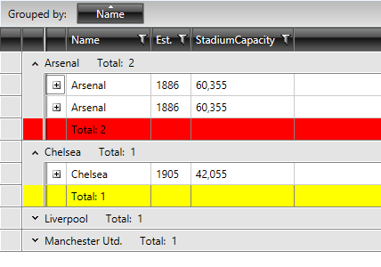

# GroupFooterRowStyleSelector

The **GroupFooterRowStyleSelector** property of RadGridView can be used to style group footer rows differently based on a specific condition.

>important Bear in mind that the **GroupFooterRowStyle** takes precedence over the **GroupFooterRowStyleSelector** and will overwrite it if both are defined simultaneously.

To do so, first create a new class that inherits the **StyleSelector** class and override its **SelectStyle** method:

__Example 1: The GroupFooterRowStyleSelector class__

```C#
	public class GroupFooterRowStyleSelector : StyleSelector
    {
        public override Style SelectStyle(object item, DependencyObject container)
        {
            var group = item as QueryableCollectionViewGroup;

            if (group != null)
            {
                if (group.ItemCount > 1)
                {
                    return BigGroupStyle;
                }
                else
                {
                    return SmallGroupStyle;
                }
            }

            return null;
        }

        public Style BigGroupStyle { get; set; }
        public Style SmallGroupStyle { get; set; }
    }
```
```VB.NET
	Public Class GroupFooterRowStyleSelector
	Inherits StyleSelector
		Public Overrides Function SelectStyle(item As Object, container As DependencyObject) As Style
			Dim group = TryCast(item, CollectionViewGroup)
	
			If group IsNot Nothing Then
				If group.ItemCount > 1 Then
					Return BigGroupStyle
				Else
					Return SmallGroupStyle
				End If
			End If
	
			Return Nothing
		End Function

		Public Property BigGroupStyle() As Style
			Get
				Return m_BigGroupStyle
			End Get
			Set
				m_BigGroupStyle = Value
			End Set
		End Property
		Private m_BigGroupStyle As Style

		Public Property SmallGroupStyle() As Style
			Get
				Return m_SmallGroupStyle
			End Get
			Set
				m_SmallGroupStyle = Value
			End Set
		End Property
		Private m_SmallGroupStyle As Style
	End Class
```

In the XAML file, define the style selector as a resource and set the properties of the **BigGroupStyle** and **SmallGroupStyle**:

__Example 2: Setting the BigGroupStyle and SmallGroupStyle__

```XAML
	<Grid.Resources>
		<my:GroupFooterRowStyleSelector x:Key="StadiumCapacityStyleSelector">
			<my:GroupFooterRowStyleSelector.BigGroupStyle>
				<Style TargetType="telerik:GridViewGroupFooterRow">
					<Setter Property="Background" Value="Red"/>
				</Style>
			</my:GroupFooterRowStyleSelector.BigGroupStyle>
			<my:GroupFooterRowStyleSelector.SmallGroupStyle>
				<Style TargetType="telerik:GridViewGroupFooterRow">
					<Setter Property="Background" Value="Yellow" />
				</Style>
			</my:GroupFooterRowStyleSelector.SmallGroupStyle>
		</my:GroupFooterRowStyleSelector>
	</Grid.Resources>
```

>The **"my:"** prefix before **GroupFooterRowStyleSelector** specifies the mapping for the namespace of the project: **xmlns:my="..."**

Finally, set the **GroupFooterRowStyleSelector** property:

__Example 3: Setting the GroupFooterRowStyleSelector property__

```XAML
	<telerik:RadGridView GroupFooterRowStyleSelector="{StaticResource GroupFooterRowStyleSelector}" />
```

And here is the final result:

#### __Figure 1: The group footer rows styled using the GroupFooterRowStyleSelector property__



## See Also

 * [Styling Group Row]()

 * [Styling Group Footers]()
