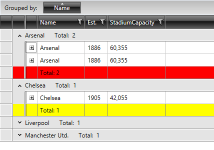

# GroupFooterRowStyleSelector

The **GroupFooterRowStyleSelector** property of RadGridView can be used to style group footer rows differently based on a specific condition.

>important Bear in mind that the **GroupFooterRowStyle** takes precedence over the **GroupFooterRowStyleSelector** and will overwrite it if both are defined simultaneously.

To do so, first create a new class that inherits the **StyleSelector** class and override its **SelectStyle** method:

__Example 1: The GroupFooterRowStyleSelector class__

<snippet id='radgridview-style-selectors-group-footer-row-styleselector-example_1_the_groupfooterrowstyleselector_class-cs' />

<snippet id='radgridview-style-selectors-group-footer-row-styleselector-example_1_the_groupfooterrowstyleselector_class-vb' />

In the XAML file, define the style selector as a resource and set the properties of the **BigGroupStyle** and **SmallGroupStyle**:

__Example 2: Setting the BigGroupStyle and SmallGroupStyle__

<snippet id='radgridview-style-selectors-group-footer-row-styleselector-example_2_setting_the_biggroupstyle_and_smallgroupstyle-xaml' />

>The **"my:"** prefix before **GroupFooterRowStyleSelector** specifies the mapping for the namespace of the project: **xmlns:my="..."**

Finally, set the **GroupFooterRowStyleSelector** property:

__Example 3: Setting the GroupFooterRowStyleSelector property__

<snippet id='radgridview-style-selectors-group-footer-row-styleselector-example_3_setting_the_groupfooterrowstyleselector_property-xaml' />

And here is the final result:

#### __Figure 1: The group footer rows styled using the GroupFooterRowStyleSelector property__

## See Also

 * [Styling Group Row]()

 * [Styling Group Footers]()
