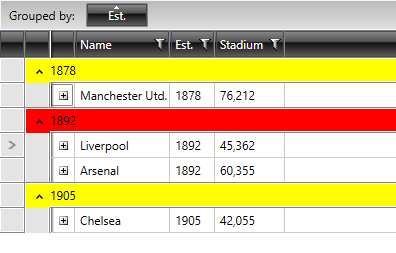

# GroupRowStyleSelector

You can use RadGridView's **GroupRowStyleSelector** property if you need to style group rows differently based on a specific condition.

>important Bear in mind that the [GroupRowStyle]() takes precedence over the **GroupRowStyleSelector** and will overwrite it if both are defined simultaneously.

To achieve this, first create a new class that inherits from the **StyleSelector** class and override its **SelectStyle** method:

__Example 1: The GroupRowStyleSelector class__

<snippet id='radgridview-style-selectors-group-row-style-selector-example_1_the_grouprowstyleselector_class-cs' />

<snippet id='radgridview-style-selectors-group-row-style-selector-example_1_the_grouprowstyleselector_class-vb' />

In the XAML file, define the style selector as a resource and set the properties of the **BigGroupStyle** and **SmallGroupStyle**:

__Example 2: Setting the BigGroupStyle and SmallGroupStyle__

<snippet id='radgridview-style-selectors-group-row-style-selector-example_2_setting_the_biggroupstyle_and_smallgroupstyle-xaml' />

>If you're using **GroupRenderMode="Nested"** the style should target the **GridViewGroupRow** element.

>The **"my:"** prefix before **GroupRowStyleSelector** specifies the mapping for the namespace of the project: **xmlns:my="..."**

Finally, set the **GroupRowStyleSelector** property:

__Example 3: Setting the GroupRowStyleSelector property__

<snippet id='radgridview-style-selectors-group-row-style-selector-example_3_setting_the_grouprowstyleselector_property-xaml' />

And here is the final result:

#### __Figure 1: The group footer rows styled using the GroupRowStyleSelector property__

## See Also

* [Styling Group Row]()

* [CellStyleSelector]()
