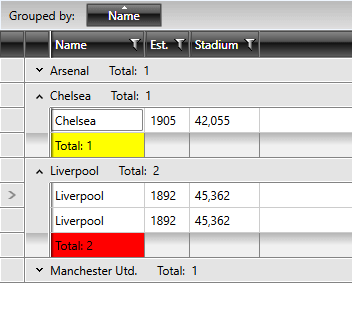

# GroupFooterCellStyleSelector

The **GroupFooterCellStyleSelector** property of RadGridView can be used to style group footer rows differently based on a specific condition.

>importantBear in mind that the **GroupFooterCellStyle** takes precedence over the **GroupFooterCellStyleSelector** and will overwrite it if both are defined simultaneously.

To do so, first create a new class that inherits the **StyleSelector** class and override its **SelectStyle** method:

__Example 1: The GroupFooterCellStyleSelector class__

	```C#
    public class GroupFooterCellStyleSelector : StyleSelector
    {
        public override Style SelectStyle(object item, DependencyObject container)
        {
            var cell = container as GridViewGroupFooterCell;
            var footerRow = cell.ParentRow as GridViewGroupFooterRow;
            var group = footerRow.Group as QueryableCollectionViewGroup;

            if (group.ItemCount > 1)
            {
                return BigGroupStyle;
            }
            else
            {
                return SmallGroupStyle;
            }
        }

        public Style BigGroupStyle { get; set; }
        public Style SmallGroupStyle { get; set; }
    }
	```
```VB.NET
	Public Class GroupFooterCellStyleSelector
		Inherits StyleSelector

		Public Overrides Function SelectStyle(ByVal item As Object, ByVal container As DependencyObject) As Style
			Dim cell = TryCast(container, GridViewGroupFooterCell)
			Dim footerRow = TryCast(cell.ParentRow, GridViewGroupFooterRow)
			Dim group = TryCast(footerRow.Group, QueryableCollectionViewGroup)

			If group.ItemCount > 1 Then
				Return BigGroupStyle
			Else
				Return SmallGroupStyle
			End If
		End Function

		Public Property BigGroupStyle() As Style
		Public Property SmallGroupStyle() As Style
	End Class
	```

In the XAML file, define the style selector as a resource and set the properties of the **BigGroupStyle** and **SmallGroupStyle**:

__Example 2: Setting the BigGroupStyle and SmallGroupStyle__

	```XAML
	<Grid.Resources>
        <my:GroupFooterCellStyleSelector x:Key="GroupFooterCellStyleSelector">
            <my:GroupFooterCellStyleSelector.BigGroupStyle>
                <Style TargetType="telerik:GridViewGroupFooterCell">
                    <Setter Property="Background" Value="Red"/>
                </Style>
            </my:GroupFooterCellStyleSelector.BigGroupStyle>
            <my:GroupFooterCellStyleSelector.SmallGroupStyle>
                <Style TargetType="telerik:GridViewGroupFooterCell">
                    <Setter Property="Background" Value="Yellow" />
                </Style>
            </my:GroupFooterCellStyleSelector.SmallGroupStyle>
        </my:GroupFooterCellStyleSelector>
	</Grid.Resources>
	```

>The **"my:"** prefix before **GroupFooterCellStyleSelector** specifies the mapping for the namespace of the project: **xmlns:my="..."**

Finally, set the **GroupFooterCellStyleSelector** property of the chosen column:

__Example 3: Setting the GroupFooterCellStyleSelector property__

	```XAML
	<telerik:GridViewDataColumn DataMemberBinding="{Binding Name}" GroupFooterCellStyleSelector="{StaticResource GroupFooterCellStyleSelector}" />
	```

**Figure 1** shows the final result:

#### __Figure 1: The group footer cells styled using the GroupFooterCellStyleSelector property__



## See Also

* [Styling Group Row]()

* [Styling Group Footers]()
