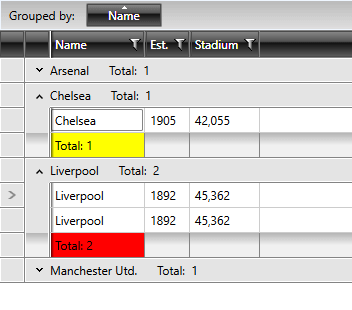

# GroupFooterCellStyleSelector

The **GroupFooterCellStyleSelector** property of RadGridView can be used to style group footer rows differently based on a specific condition.

>important Bear in mind that the **GroupFooterCellStyle** takes precedence over the **GroupFooterCellStyleSelector** and will overwrite it if both are defined simultaneously.

To do so, first create a new class that inherits the **StyleSelector** class and override its **SelectStyle** method:

__Example 1: The GroupFooterCellStyleSelector class__

<snippet id='radgridview-style-selectors-groupfootercell-styleselector-example_1_the_groupfootercellstyleselector_class-cs' />

<snippet id='radgridview-style-selectors-groupfootercell-styleselector-example_1_the_groupfootercellstyleselector_class-vb' />

In the XAML file, define the style selector as a resource and set the properties of the **BigGroupStyle** and **SmallGroupStyle**:

__Example 2: Setting the BigGroupStyle and SmallGroupStyle__

<snippet id='radgridview-style-selectors-groupfootercell-styleselector-example_2_setting_the_biggroupstyle_and_smallgroupstyle-xaml' />

>The **"my:"** prefix before **GroupFooterCellStyleSelector** specifies the mapping for the namespace of the project: **xmlns:my="..."**

Finally, set the **GroupFooterCellStyleSelector** property of the chosen column:

__Example 3: Setting the GroupFooterCellStyleSelector property__

<snippet id='radgridview-style-selectors-groupfootercell-styleselector-example_3_setting_the_groupfootercellstyleselector_property-xaml' />

**Figure 1** shows the final result:

#### __Figure 1: The group footer cells styled using the GroupFooterCellStyleSelector property__

## See Also

* [Styling Group Row]()

* [Styling Group Footers]()
