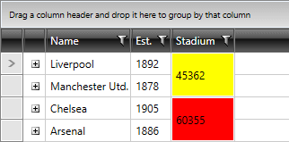

# MergedCellsStyleSelector

__RadGridView__'s **MergedCellsStyleSelector** can be used to style merged cells differently based on a specific condition.

>importantBear in mind that the **MergedCellsStyle** takes precedence over the **MergedCellsStyleSelector** and will overwrite it if both are defined simultaneously.

To do so, first create a new class that inherits the **StyleSelector** class and override its **SelectStyle** method:

__Example 1: The StadiumCapacityStyleSelector class__

	```C#
	public class StadiumCapacityStyleSelector : StyleSelector
    {
        public override Style SelectStyle(object item, DependencyObject container)
        {
            var cell = item as MergedCellInfo;

            if (cell != null)
            {
                if (int.Parse(cell.Value.ToString()) > 50000)
                {
                    return BigStadiumStyle;
                }
                else
                {
                    return SmallStadiumStyle;
                }
            }

            return null; 
        }
        public Style BigStadiumStyle { get; set; }
        public Style SmallStadiumStyle { get; set; }
    }
	```
```VB.NET
	Public Class StadiumCapacityStyleSelector
		Inherits StyleSelector
		Public Overrides Function SelectStyle(item As Object, container As DependencyObject) As Style
			Dim cell = TryCast(item, MergedCellInfo)
	
			If cell IsNot Nothing Then
				If Integer.Parse(cell.Value.ToString()) > 50000 Then
					Return BigStadiumStyle
				Else
					Return SmallStadiumStyle
				End If
			End If
	
			Return Nothing
		End Function
		Public Property BigStadiumStyle() As Style
			Get
				Return m_BigStadiumStyle
			End Get
			Set
				m_BigStadiumStyle = Value
			End Set
		End Property
		Private m_BigStadiumStyle As Style
		Public Property SmallStadiumStyle() As Style
			Get
				Return m_SmallStadiumStyle
			End Get
			Set
				m_SmallStadiumStyle = Value
			End Set
		End Property
		Private m_SmallStadiumStyle As Style
	End Class
	```

In the XAML file, define the style selector as a resource and set the properties of the **BigStadiumStyle** and **SmallStadiumStyle**:

__Example 2: Setting the BigStadiumStyle and SmallStadiumStyle__

	```XAML
	<Grid.Resources>
        <my:StadiumCapacityStyleSelector x:Key="StadiumCapacityStyleSelector">
            <my:StadiumCapacityStyleSelector.BigStadiumStyle>
                <Style TargetType="telerik:GridViewMergedCell">
                    <Setter Property="Background" Value="Red"/>
                </Style>
            </my:StadiumCapacityStyleSelector.BigStadiumStyle>
            <my:StadiumCapacityStyleSelector.SmallStadiumStyle>
                <Style TargetType="telerik:GridViewMergedCell">
                    <Setter Property="Background" Value="Yellow" />
                </Style>
            </my:StadiumCapacityStyleSelector.SmallStadiumStyle>
        </my:StadiumCapacityStyleSelector>
	</Grid.Resources>
	```

>The **"my:"** prefix before **StadiumCapacityStyleSelector** specifies the mapping for the namespace of the project: **xmlns:my="..."**

Finally, set the **MergedCellsStyleSelector** property:

__Example 3: Setting the MergedCellsStyleSelector property__

	```XAML
	<telerik:RadGridView MergedCellsDirection="Vertical" MergedCellsStyleSelector="{StaticResource StadiumCapacityStyleSelector}" />
	```

And here is the final result:

#### __Figure 1: The merged cells styled using the MergedCellsStyleSelector property__



## See Also

* [Merged Cells]()
* [Styling a Cell]()
* [Styling Merged Cells]()
