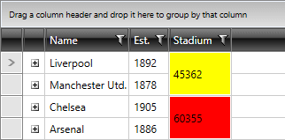

# MergedCellsStyleSelector

__RadGridView__'s **MergedCellsStyleSelector** can be used to style merged cells differently based on a specific condition.

>important Bear in mind that the **MergedCellsStyle** takes precedence over the **MergedCellsStyleSelector** and will overwrite it if both are defined simultaneously.

To do so, first create a new class that inherits the **StyleSelector** class and override its **SelectStyle** method:

__Example 1: The StadiumCapacityStyleSelector class__

<snippet id='radgridview-style-selectors-merged-cells-style-selector-example_1_the_stadiumcapacitystyleselector_class-cs' />

<snippet id='radgridview-style-selectors-merged-cells-style-selector-example_1_the_stadiumcapacitystyleselector_class-vb' />

In the XAML file, define the style selector as a resource and set the properties of the **BigStadiumStyle** and **SmallStadiumStyle**:

__Example 2: Setting the BigStadiumStyle and SmallStadiumStyle__

<snippet id='radgridview-style-selectors-merged-cells-style-selector-example_2_setting_the_bigstadiumstyle_and_smallstadiumstyle-xaml' />

>The **"my:"** prefix before **StadiumCapacityStyleSelector** specifies the mapping for the namespace of the project: **xmlns:my="..."**

Finally, set the **MergedCellsStyleSelector** property:

__Example 3: Setting the MergedCellsStyleSelector property__

<snippet id='radgridview-style-selectors-merged-cells-style-selector-example_3_setting_the_mergedcellsstyleselector_property-xaml' />

And here is the final result:

#### __Figure 1: The merged cells styled using the MergedCellsStyleSelector property__

## See Also

* [Merged Cells]()
* [Styling a Cell]()
* [Styling Merged Cells]()
