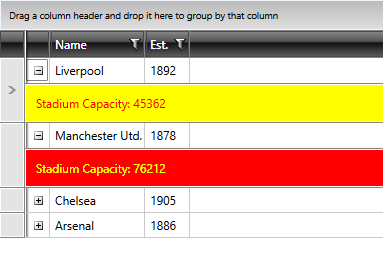

# RowDetailsStyleSelector

This article illustrates how to conditionally style row details through RadGridView's **RowDetailsStyleSelector** property.
		
>tipLearn more about [StyleSelectors]().

First, create a new class which inherits the __StyleSelector__ class (which resides in the 
 __Telerik.Windows.Controls____System.Windows.Controls__ assembly) and override its __SelectStyle__ method. Based on your conditions you return the proper Style that will be applied to the **DetailsPresenter** element.

__Example 1: The ConditionalStyleSelector class__

```C#

    public class ConditionalStyleSelector : StyleSelector
    {
        public override Style SelectStyle(object item, DependencyObject container)
        {
            if (item is Club)
            {
                var club = item as Club;
                if (club.StadiumCapacity > 50000)
                {
                    return BigStadiumStyle;
                }
                else
                {
                    return SmallStadiumStyle;
                }
            }

            return base.SelectStyle(item, container);
        }

        public Style BigStadiumStyle { get; set; }
        public Style SmallStadiumStyle { get; set; }
    }
```
```VB.NET

	Public Class StadiumCapacityStyle
	 Inherits StyleSelector
	 Public Overrides Function SelectStyle(item As Object, container As DependencyObject) As Style
	  If TypeOf item Is Club Then
	   Dim club As Club = TryCast(item, Club)
	   If club.StadiumCapacity > 50000 Then
	    Return BigStadiumStyle
	   Else
	    Return SmallStadiumStyle
	   End If
	  End If
	  Return Nothing
	 End Function
	 Public Property BigStadiumStyle() As Style
	  Get
	   Return m_BigStadiumStyle
	  End Get
	  Set
	   m_BigStadiumStyle = Value
	  End Set
	 End Property
	 Private m_BigStadiumStyle As Style
	 Public Property SmallStadiumStyle() As Style
	  Get
	   Return m_SmallStadiumStyle
	  End Get
	  Set
	   m_SmallStadiumStyle = Value
	  End Set
	 End Property
	 Private m_SmallStadiumStyle As Style
	End Class
```

In this case we have two different styles that could be applied:

* __BigStadiumStyle__
* __SmallStadiumStyle__. 

Depending on the underlying data you can select which style to apply.

Next, in the XAML file define the style selector as a resource and set the properties of the __BigStadiumStyle__ and __SmallStadiumStyle__:

__Example 2: Set the different styles for the style selector__

```XAML
		<Grid.Resources>
            <my:ConditionalStyleSelector x:Key="StadiumCapacityStyleSelector">
                <my:ConditionalStyleSelector.BigStadiumStyle>
                    <Style TargetType="telerik:DetailsPresenter">
                        <Setter Property="Background" Value="Red" />
                        <Setter Property="Foreground" Value="Yellow" />
                    </Style>
                </my:ConditionalStyleSelector.BigStadiumStyle>
                <my:ConditionalStyleSelector.SmallStadiumStyle>
                    <Style TargetType="telerik:DetailsPresenter">
                        <Setter Property="Background" Value="Yellow" />
                        <Setter Property="Foreground" Value="Red" />
                    </Style>
                </my:ConditionalStyleSelector.SmallStadiumStyle>
            </my:ConditionalStyleSelector>
		</Grid.Resources>
```

>The __"my:"__ prefix before __StadiumCapacityStyle__ specifies the mapping for the namespace of the project: __xmlns:my="__

>If you are using our [Implicit Styles](), you should base the style on the **DetailsPresenterStyle**.

Finally, set the __RowDetailsStyleSelector__ property of the RadGridView:

__Example 3: Set RadGridView's RowDetailsStyleSelector__

```XAML

	<telerik:RadGridView RowDetailsStyleSelector="{StaticResource StadiumCapacityStyleSelector}" />
```

And here is the final result:

#### __Figure 1: The row details styled using the RowDetailsStyleSelector property__


		 
>tipAnother approach for achieving the same result is demonstrated in the [Silverlight Controls Samples](https://demos.telerik.com/silverlight/#GridView/Selectors/StyleSelectors/RowDetailsStyleSelector)[WPF Controls Samples](https://demos.telerik.com/wpf/) under **StyleSelectors -> Row Details**.

## See Also

 * [Styling Row Details]()
