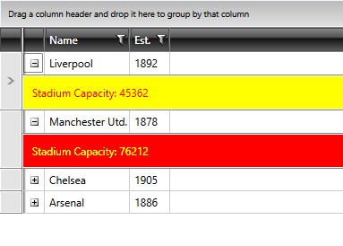

# RowDetailsStyleSelector

This article illustrates how to conditionally style row details through RadGridView's **RowDetailsStyleSelector** property.

First, create a new class which inherits the __StyleSelector__ class (which resides in the 
 __Telerik.Windows.Controls____System.Windows.Controls__ assembly) and override its __SelectStyle__ method. Based on your conditions you return the proper Style that will be applied to the **DetailsPresenter** element.

__Example 1: The ConditionalStyleSelector class__

<snippet id='radgridview-style-selectors-rowdetails-styleselector-example_1_the_conditionalstyleselector_class-cs' />

<snippet id='radgridview-style-selectors-rowdetails-styleselector-example_1_the_conditionalstyleselector_class-vb' />

In this case we have two different styles that could be applied:

* __BigStadiumStyle__
* __SmallStadiumStyle__. 

Depending on the underlying data you can select which style to apply.

Next, in the XAML file define the style selector as a resource and set the properties of the __BigStadiumStyle__ and __SmallStadiumStyle__:

__Example 2: Set the different styles for the style selector__

<snippet id='radgridview-style-selectors-rowdetails-styleselector-example_2_set_the_different_styles_for_the_style_selector-xaml' />

>The __"my:"__ prefix before __StadiumCapacityStyle__ specifies the mapping for the namespace of the project: __xmlns:my="__

>If you are using our [Implicit Styles](), you should base the style on the **DetailsPresenterStyle**.

Finally, set the __RowDetailsStyleSelector__ property of the RadGridView:

__Example 3: Set RadGridView's RowDetailsStyleSelector__

<snippet id='radgridview-style-selectors-rowdetails-styleselector-example_3_set_radgridview_s_rowdetailsstyleselector-xaml' />

And here is the final result:

#### __Figure 1: The row details styled using the RowDetailsStyleSelector property__

		 
>tip Another approach for achieving the same result is demonstrated in the [Silverlight Controls Samples](https://demos.telerik.com/silverlight/#GridView/Selectors/StyleSelectors/RowDetailsStyleSelector)[WPF Controls Samples](https://demos.telerik.com/wpf/) under **StyleSelectors -> Row Details**.

## See Also

 * [Styling Row Details]()
