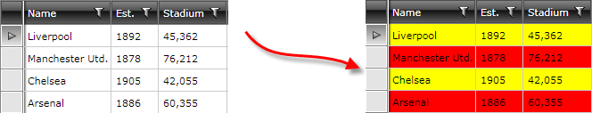

# RowStyleSelector

This article illustrates how to conditionally style rows through RadGridView's [RowStyleSelector](#rowstyleselector) and [AlternateRowStyleSelector](alternaterowstyleselector) properties.
		
>tipLearn more about [StyleSelectors]().

# RowStyleSelector
		  
Assume we have RadGridView bound to a collection of Clubs. Each Club has a property StadiumCapacity. What we want to achieve is to set the background color of the rows to __Red if the capacity > 50 000 or Yellow otherwise__:
		

To do so follow these steps:

1. Create a new class which inherits the __StyleSelector__ class (which resides in the 
 __Telerik.Windows.Controls____System.Windows.Controls__ assembly).

2. Override its __SelectStyle__ method. Based on your conditions - you return the proper Style that will be applied to the framework element (row in our case).

#### __C#__

{{region gridview-rowstyleselector_0}}

	public class StadiumCapacityStyle : StyleSelector
	{
	 public override Style SelectStyle(object item, DependencyObject container)
	 {
	  if (item is Club)
	  {
	   Club club = item as Club;
	   if (club.StadiumCapacity > 50000)
	   {
	    return BigStadiumStyle;
	   }
	   else
	   {
	    return SmallStadiumStyle;
	   }
	  }
	  return null;
	 }
	 public Style BigStadiumStyle { get; set; }
	 public Style SmallStadiumStyle { get; set; }
	}
{{endregion}}

#### __VB.NET__

{{region gridview-rowstyleselector_1}}

	Public Class StadiumCapacityStyle
	 Inherits StyleSelector
	 Public Overrides Function SelectStyle(item As Object, container As DependencyObject) As Style
	  If TypeOf item Is Club Then
	   Dim club As Club = TryCast(item, Club)
	   If club.StadiumCapacity > 50000 Then
	    Return BigStadiumStyle
	   Else
	    Return SmallStadiumStyle
	   End If
	  End If
	  Return Nothing
	 End Function
	 Public Property BigStadiumStyle() As Style
	  Get
	   Return m_BigStadiumStyle
	  End Get
	  Set
	   m_BigStadiumStyle = Value
	  End Set
	 End Property
	 Private m_BigStadiumStyle As Style
	 Public Property SmallStadiumStyle() As Style
	  Get
	   Return m_SmallStadiumStyle
	  End Get
	  Set
	   m_SmallStadiumStyle = Value
	  End Set
	 End Property
	 Private m_SmallStadiumStyle As Style
	End Class
{{endregion}}

In this case we have two different styles that could be applied:

* __BigStadiumStyle__
* __SmallStadiumStyle__. 

Depending on the underlying data you cab select which style to apply.

3.In the XAML file define the style selector as a resource and set the properties of the __BigStadiumStyle__ and __SmallStadiumStyle__:

#### __XAML__

{{region gridview-rowstyleselector_2}}
	<Grid>
		<Grid.Resources>
			<my:StadiumCapacityStyle x:Key="stadiumCapacityStyle">
				<my:StadiumCapacityStyle.BigStadiumStyle>
					
				</my:StadiumCapacityStyle.BigStadiumStyle>
				<my:StadiumCapacityStyle.SmallStadiumStyle>
					
				</my:StadiumCapacityStyle.SmallStadiumStyle>
			</my:StadiumCapacityStyle>
		</Grid.Resources>
		...
	</Grid>
{{endregion}}

>The __"my:"__ prefix before __StadiumCapacityStyle__ specifies the mapping for the namespace of the project: __xmlns:my="__

If you are using our [Implicit Themes](), you should base the style on the one defined for the corresponding theme:

#### __XAML__

{{region gridview-rowstyleselector_4}}

    
{{endregion}}

4.Finally, set the __RowStyleSelector__ property:

#### __XAML__

{{region gridview-rowstyleselector_3}}

	<telerik:RadGridView RowStyleSelector="{StaticResource StadiumCapacityStyle}" />
{{endregion}}

>tipIf you are using [Implicit Themes](), you should base the style on the one defined for the corresponding theme.

>Since the virtualization of the control is turned on by default, it is not recommended to work with the visual elements (i.e. GridViewRow) and their properties. You should not set properties of GridViewRow inside SelectStyle method. [Read mode on UI Virtualization]().
		 
>tipYou can download a runnable project of the previous example from our online SDK repository [here](https://github.com/telerik/xaml-sdk/), the example is listed as __GridView/RowStyleSelector__.

## AlternateRowStyleSelector

If you've set the **AlternationCount** property, you can apply conditional styles only on the [alternating rows]() by specifying an **AlternateRowStyleSelector**. **Figure 2** shows the result of using the same StyleSelector from the previous example, but setting it as the AlternateRowStyleSelector for the RadGridView.

{{region gridview-rowstyleselector_5}}

	<telerik:RadGridView AlternateRowStyleSelector="{StaticResource StadiumCapacityStyle}" />
{{endregion}}

# See Also

 * [UI Virtualization]()
          
