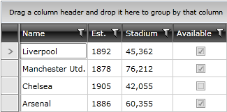
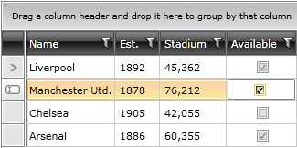
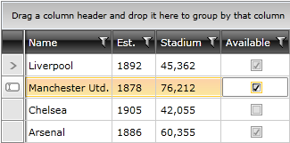

# Styling GridViewCheckBoxColumn

This topic will show you how to style the __GridViewCheckBoxColumn__.

* [Styling GridViewCheckBoxColumn in View Mode](#styling-gridviewcheckboxcolumn-in-view-mode)

* [Styling GridViewCheckBoxColumn in Edit Mode](#styling-gridviewcheckboxcolumn-in-edit-mode)

* [Applying the Styles to GridViewCheckBoxColumn explicitly](#applying-the-styles-to-gridviewcheckboxcolumn-explicitly)

* [Centering GridViewCheckBoxColumn](#centering-gridviewcheckboxcolumn) 

The cells of __RadGridView__ have two templates for their current state - when in __view mode__ and in __edit mode__. By default, __GridViewCheckBoxColumn__ uses a __GridViewCheckBox__ when in __view mode__ and the standard __CheckBox__ control as its __editor__. __GridViewCheckBox__ is an element that emulates the behavior of a __CheckBox__ and is especially designed for __RadGridView__. 

>In order to style the whole cell rather than the __GridViewCheckBox__ element only, you can set the __CellStyle__ property of the __GridViewCheckBoxColumn__. You can find more information in the [Styling Cells]() topic. 

## Styling GridViewCheckBoxColumn in View Mode

#### __Figure 1: Default look of GridViewCheckBox__
        

In order to modify the visual appearance of a cell in __view mode__, the __ControlTemplate__ of __GridViewCheckBox__ should be modified.

#### __[XAML] Example 1: Defining the ControlTemplate of GridViewCheckBox__

	<ControlTemplate x:Key="GridViewCheckBoxTemplate" TargetType="grid:GridViewCheckBox">
            ...
    </ControlTemplate>

After the needed __ControlTemplate__ is defined, it can be applied using the __Template__ property of __GridViewCheckBox__.

#### __[XAML] Example 2: Applying the ControlTemplate to GridViewCheckBox__

	

	

    
{{endregion}}

Now the __GridViewCheckBoxColumn__ will look like:

#### __Figure 2: Centered GridViewCheckBoxColumn__     

However, there is a pixel offset when the __GridViewCheckBoxColumn__ goes into edit mode:

#### __Figure 3: Centered GridViewCheckBoxColumn in edit mode__       

In order to align the default editor of __GridViewCheckBoxColumn__ correctly, you can specify a different __Margin__ for it by handling the __PreparingCellForEdit__ event of __RadGridView__:
        

#### __[C#] Example 5: Setting the Margin of the Editor GridViewCheckBoxColumn__

	private void RadGridView_PreparingCellForEdit(object sender, Telerik.Windows.Controls.GridViewPreparingCellForEditEventArgs e)
	{
	   if (e.Column.UniqueName == "GridViewCheckBoxColumn")
	   {
	       var checkBox = e.EditingElement as CheckBox;
	       checkBox.Margin = new Thickness(4, 0, -3, 0);
	   }
	}

Here is the result:

#### __Figure 4 GridViewCheckBoxColumn with set margin__
        

# See Also

 * [CheckBox Column]()
