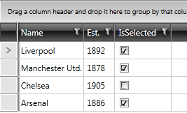

# Styling the CheckBoxColumn

This topic will show you how to style the __GridViewCheckBoxColumn__

The standard GridViewCheckBoxColumn uses a __GridViewCheckBox__ in view mode and the standard __CheckBox__ control as its editor. __GridViewCheckBox__ is an element that emulates the behavior of a CheckBox and it is especially designed for RadGridView. Its control template contains a Grid container with Path elements that appear in its Checked/Indeterminate states. 

## Applying the default MS CheckBox style to GridViewCheckBox

__GridViewCheckBox__ is gray colored by design when the cell is not in __Edit__ mode.
        

If you want to predefine __GridViewCheckBox__ to look like the default __CheckBox__ control, you have two options:
        

* To copy the default style of __GridViewCheckBox__ and modify it using __MS Expression Blend__. You can find its full template below:
            

#### __XAML__

{{region gridview-checkbox-column_4}}

	<ControlTemplate x:Key="GridViewCheckBoxTemplate" TargetType="grid:GridViewCheckBox">
	  <Grid HorizontalAlignment="Left" VerticalAlignment="Center" Width="13" Height="13">
	    <VisualStateManager.VisualStateGroups>
	      <VisualStateGroup x:Name="CheckStates">
	        <VisualState x:Name="Checked">
	          <Storyboard>
	            <ObjectAnimationUsingKeyFrames BeginTime="0" Duration="0"
	                    Storyboard.TargetName="CheckedPath"
	                    Storyboard.TargetProperty="(UIElement.Visibility)">
	              <DiscreteObjectKeyFrame KeyTime="0">
	                <DiscreteObjectKeyFrame.Value>
	                  <Visibility>Visible</Visibility>
	                </DiscreteObjectKeyFrame.Value>
	              </DiscreteObjectKeyFrame>
	            </ObjectAnimationUsingKeyFrames>
	          </Storyboard>
	        </VisualState>
	        <VisualState x:Name="Unchecked" />
	        <VisualState x:Name="Indeterminate">
	          <Storyboard>
	            <ObjectAnimationUsingKeyFrames BeginTime="0" Duration="0"
	                    Storyboard.TargetName="IndeterminatePath"
	                    Storyboard.TargetProperty="(UIElement.Visibility)">
	              <DiscreteObjectKeyFrame KeyTime="0">
	                <DiscreteObjectKeyFrame.Value>
	                  <Visibility>Visible</Visibility>
	                </DiscreteObjectKeyFrame.Value>
	              </DiscreteObjectKeyFrame>
	            </ObjectAnimationUsingKeyFrames>
	          </Storyboard>
	        </VisualState>
	      </VisualStateGroup>
	    </VisualStateManager.VisualStateGroups>
	    <Border BorderBrush="#FF989898" BorderThickness="1 1 1 1">
	      <Border BorderBrush="#FFEEEEEE" BorderThickness="1 1 1 1">
	        <Border BorderThickness="1 1 1 1" Background="#FFE0E0E0" BorderBrush="#FFB9B9B9">
	          <Grid Margin="0">
	            <Path x:Name="IndeterminatePath" Visibility="Collapsed" Stretch="Fill" Stroke="#FF8D8D8D" StrokeThickness="1.5" Data="M14.708333,144.5 L20.667,144.5" Width="7" Height="7" HorizontalAlignment="Center" VerticalAlignment="Center" Margin="0"/>
	            <Path x:Name="CheckedPath"  Visibility="Collapsed" Stretch="Fill" Stroke="#FF8D8D8D" Data="M32.376187,77.162509 L35.056467,80.095277 40.075451,70.02144" StrokeThickness="1.5" Margin="0" HorizontalAlignment="Center" VerticalAlignment="Center"/>
	          </Grid>
	        </Border>
	      </Border>
	    </Border>
	  </Grid>
	</ControlTemplate>
	
	
	
	
{{endregion}}

Now the __GridViewCheckBoxColumn__ will look like:
        

However, there is a pixel offset when the GridViewCheckBoxColumn goes into edit mode:
        

In order to align the dafault editor of GridViewCheckBoxColumn correctly, you can specify a different Margin for it by handling the PreparingCellForEdit event of RadGridView:
        

#### __C#__

{{region gridview-checkbox-column_4}}

	private void RadGridView_PreparingCellForEdit(object sender, Telerik.Windows.Controls.GridViewPreparingCellForEditEventArgs e)
	{
	   if (e.Column.UniqueName == "GridViewCheckBoxColumn")
	   {
	       var checkBox = e.EditingElement as CheckBox;
	       checkBox.Margin = new Thickness(4, 0, -3, 0);
	   }
	}
{{endregion}}

#### __VB.NET__

{{region gridview-checkbox-column_5}}
    Private Sub RadGridView_PreparingCellForEdit(sender As Object, e As Telerik.Windows.Controls.GridViewPreparingCellForEditEventArgs)
        If e.Column.UniqueName = "GridViewCheckBoxColumn" Then
            Dim checkBox = TryCast(e.EditingElement, CheckBox)
            checkBox.Margin = New Thickness(4, 0, -3, 0)
        End If
    End Sub
{{endregion}}

Here is the result:
        

# See Also

 * [CheckBox Column]()
