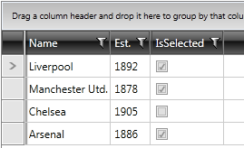

# Styling GridViewCheckBoxColumn

This topic will show you how to style the __GridViewCheckBoxColumn__.

The cells of __RadGridView__ have two different elements for their current state - when in __view mode__ and in __edit mode__. By default, the __GridViewCheckBoxColumn__ uses a __GridViewCheckBox__ when in __view mode__ and the standard __CheckBox__ control as its __editor__. The __GridViewCheckBox__ is an element that emulates the behavior of a __CheckBox__ and is especially designed for __RadGridView__ to improve its performance. 

>In order to style the whole cell rather than the __GridViewCheckBox__ element only, you can set the __CellStyle__ property of the __GridViewCheckBoxColumn__. You can find more information in the [Styling Cells]() topic. 

## Styling GridViewCheckBoxColumn in View Mode

#### __Figure 1: Default look of GridViewCheckBox__        

In order to modify the visual appearance of a cell when in __view mode__ you need to create an appropriate style targeting the **GridViewCheckBox** element. You can also [edit its control template]() if you wish to apply further customizations.

__Example 2: Applying the style to the GridViewCheckBox__
<snippet id='radgridview-styles-and-templates-columns-styling-checkboxcolumn-example_2_applying_the_style_to_the_gridviewcheckbox-xaml' />

>If you want to apply this style only to a particular column, you can assign it an x:Key value and set the **CellStyle** property of the respective column.

## Styling GridViewCheckBoxColumn in Edit Mode

In order to alter the appearance of the __editor__ of __GridViewCheckBoxColumn__, you need to create an appropriate style targeting the __CheckBox__ control.

__Example 3: Applying the style to the CheckBox__
<snippet id='radgridview-styles-and-templates-columns-styling-checkboxcolumn-example_3_applying_the_style_to_the_checkbox-xaml' />

You then need to set this style as the [EditorStyle]() property of the columns you wish to affect.

__Example 4: Applying the style to the CheckBox__
<snippet id='radgridview-styles-and-templates-columns-styling-checkboxcolumn-example_4_applying_the_style_to_the_checkbox-xaml' />

## See Also
 * [CheckBox Column]()