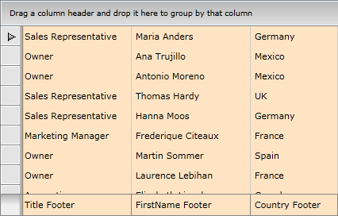
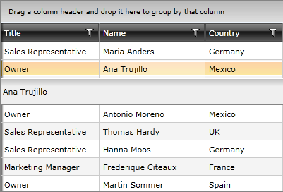
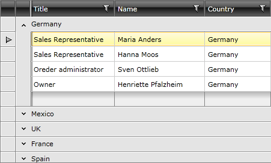

# Controlling Appearance


There are a number of ways to customize the look & feel of your __RadGridView__ control. This topic covers some of the most important of these properties.

>tipIf you need to completely redesign your __RadGridView__ control, take a look at the [Templating]() section.

## General

This section covers the following properties:

* __GridLinesVisibility__ - control the way by which the grid lines are visualized. Choose one of the four possible values defined in the __GridLinesVisibility__ enumeration: __Both__, __Horizontal__, __Vertical__ and __None__. 


* __ShowColumnHeaders__ - show\hide the column headers. 


* __ShowColumnFooters__ - show\hide the column footers. 


* __ColumnBackground__ - define default background color for all columns. 


* __VerticalGridLinesBrush__- define default color for all vertical grid lines. 


* __HorizontalGridLinesBrush__- define default color for all horizontal grid lines.

Here is a small sample, demonstrating the usage of some of the above properties.


```XAML
	<telerik:RadGridView GridLinesVisibility="Vertical"
	             ShowColumnFooters="True"
	             ShowColumnHeaders="False"
	             ColumnBackground="Bisque"/>
```

The final result should be similar to this:



You can see that the columns headers are not visible, while the column footers are, moreover there are only vertical grid lines and the columns' __background__ of all columns is set to Bisque.

## Columns

This section covers the following properties:

* __MinColumnWidth__ - gets or sets the __minimum__ width constraint of a __GridViewColumn__. The minimum width of the object, in pixels. This value can be any value equal to or greater than 0. However, __System.Double.PositiveInfinity__ is __not__ valid. 

* __MaxColumnWidth__ - gets or sets the __maximum__ width constraint of a __GridViewColumn__. The maximum width of the object, in pixels. The default is __System.Double.PositiveInfinity__. This value can be any value equal to or greater than 0. __System.Double.PositiveInfinity__ is __also valid__.  

* __ColumnWidth__ - gets or sets the width of a __GridViewColumn__. 

Here is a small sample, demonstrating the usage of some of the above properties.


```XAML
	<telerik:RadGridView MinColumnWidth="20" MaxColumnWidth="100" ColumnWidth="80"/>
```

## Rows

This section covers the following properties:

* __RowIndicatorVisibility__ - show\hide the row indicators, located on left of each row. 

* __RowDetailsVisibilityMode__ - control the way by which row details are visualized. Choose one of the three possible values defined in the __GridViewRowDetailsVisibilityMode__ enumeration: __Collapsed__, __Visible__ and __VisibleWhenSelected__. 

* __AlternationCount__ - control the alternate rows. Usually you need to set it to 2, so every second row will have alternating style applied.

* __RowStyle__ - specify a style for the grid rows. [Read more]()

* __AlternateRowStyle__ - specify a style for the alternative grid rows. [Read more]()

* __RowDetailsStyle__ - specify a style for the row details. [Read more]()

* __HeaderRowStyle__ - specify a style for the grid's header row. [Read more]()

Here is a small sample, demonstrating the usage of some of the above properties.


```XAML
	<telerik:RadGridView RowIndicatorVisibility="Collapsed"
	             RowDetailsVisibilityMode="VisibleWhenSelected"
	             AlternationCount="2">
	    <telerik:RadGridView.RowDetailsTemplate>
	        <DataTemplate>
	            <Border BorderThickness="2" Height="35">
	                <TextBlock Text="{Binding Name}" VerticalAlignment="Center" HorizontalAlignment="Center"></TextBlock>
	            </Border>
	        </DataTemplate>
	    </telerik:RadGridView.RowDetailsTemplate>
	</telerik:RadGridView>
```



You can see that the row indicators are missing and the row details are displayed only for the selected row. Moreover each even row has different styling because of the property __AlternationCount__.

## Groups

This section covers the following properties:

* __ShowGroupFooters__ - show\hide the group footers, located at the bottom of each group. 

* __ShowGroupPanel__ - show\hide the group panel, located at the top of the __RadGridView__ control. 

* __GroupRowStyle__ - specify a style for the group row. [Read more]()

* __GroupFooterRowStyle__ - specify a style for the footer group row. [Read more]()

Here is a small sample, demonstrating the usage of some of the above properties.


```XAML
	<telerik:RadGridView ShowGroupFooters="True" ShowGroupPanel="False">
	    <telerik:RadGridView.GroupDescriptors>
	        <telerik:GroupDescriptor Member="Country">
	        </telerik:GroupDescriptor>
	    </telerik:RadGridView.GroupDescriptors>
	</telerik:RadGridView>
```



You can see that the group footers are shown, while the group panel (located at the top of the __RadGridView__) is no longer visible, thus making any changes in the grouping impossible.

## See Also

 * [Styles and Templates Overview]()

 * [Templates Structure]()
