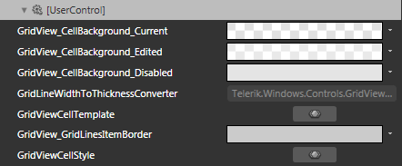
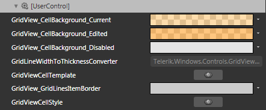
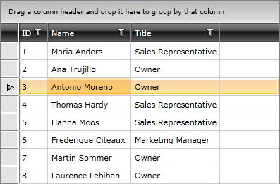

# Styling a Cell

>tipBefore reading this topic, you might find useful to get familiar with the [Template Structure of the GridViewCell control](2CD6EAA0-C735-4FA2-B921-A0D1A4452C10#GridViewCell).

The __RadGridView Cells__can be styled by creating an appropriate __Style__ and setting it to the __CellStyle__ property of the __GridViewColumns__. 

You have two options:

* To create an empty style and set it up on your own.

* To copy the default style of the control and modify it.

This topic will show you how to perform the second one.

## Modifying the Default Style

>

				  The __GridViewCell__ control is located in the __Telerik.Windows.Controls.GridView__ namespace of the __Telerik.Windows.Controls.GridView__ assembly.
			  

When working in Expression Blend, the namespaces that are needed will be added automatically.

Load your project in Expression Blend and open the User Control that holds the __RadGridView__. You have to use a dummy control in order to get the default style. To create one, find the __GridViewCell__ control in the 'Assets' and draw one on the art board. In the 'Objects and Timeline' pane select the __GridViewCell__that you've drawn and from the menu choose *Object -> Edit Style -> Edit a Copy*. You will be prompted for the name of the style and where to be placed.

>tipIf you choose to define the style in Application, it would be available for the entire application. This allows you to define a style only once and then reuse it where needed.

After clicking 'OK', Expression Blend will generate the default style of the __GridViewCell__control in the __Resources__ section of your User Control. The properties available for the style will be loaded in the 'Properties' pane and you will be able to modify their default values. You can also edit the generated XAML in the XAML View or in Visual Studio.

If you go to the 'Resources' pane, you will see an editable list of resources generated together with the style and used by it. In this list you will find the brushes, styles and templates needed to change the visual appearance of the __GridViewCell.__Their names indicate to which part of the __GridViewCell__appearance they are assigned.

         
      

* __GridView_CellBackground_Current__ - a brush that represents the background color of the cell, when it is the current one.

* __GridView_CellBackground_Edited__ - a brush that represents the background color of the cell, when it is being edited.

* __GridView_CellBackground_Disabled__ - a brush that represents the background color of the cell, when it is disabled.

* __GridViewCellTemplate__ - the __ControlTemplate__, applied to the __GridViewCell__ control.

* __GridViewCellStyle__- the __Style__, applied to the __GridViewCell__ control.

To apply the style to the real cells, set it to the __CellStyle__ property of the __RadGridView__ columns.

#### __XAML__

{{region gridview-styling-cell_1}}
	<telerik:GridViewDataColumn DataMemberBinding="{Binding Name}"
	                                Header="Name"
	                                CellStyle="{StaticResource GridViewCellStyle}" />
	{{endregion}}

>

Don't forget to delete the dummy __GridViewCell__ control, when you finish editing the style.

Here is an example of these resources modified.

         
      

And here is a snapshot of the result.

         
      

# See Also

 * [Styling the GridViewEditorPresenter]()

 * [Styling the Column Footers]()

 * [Styling the Column Headers]()

 * [Change Background for Disabled Grid Elements]()
