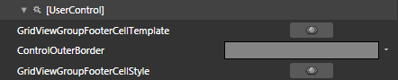
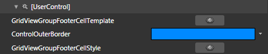

# Styling the Group Footers

>tipBefore reading this topic, you might find useful to get familiar with the [Template Structure of the GridViewGroupFooterCell control](2CD6EAA0-C735-4FA2-B921-A0D1A4452C10#GridViewGroupFooterCell).

The __RadGridView Group Footers__can be styled by creating an appropriate __Style__ and setting it to the __GroupFooterCellStyle__ property of the __GridViewColumns__. 

You have two options:

* To create an empty style and set it up on your own.

* To copy the default style of the control and modify it.

This topic will show you how to perform the second one.

## Modifying the Default Style

>tipThe __GridViewGroupFooterCell__ control is located in the __Telerik.Windows.Controls.GridView__ namespace of the __Telerik.Windows.Controls.GridView__ assembly.
			When working in Expression Blend, the namespaces that are needed will be added automatically.

Load your project in Expression Blend and open the User Control that holds the __RadGridView__. You have to use a dummy control in order to get the default style. To create one find the __GridViewGroupFooterCell__ control in the 'Assets' and draw one on the art board. In the 'Objects and Timeline' pane select the __GridViewGroupFooterCell,__you've drawn and from the menu choose *Object -> Edit Style -> Edit a Copy*. You will be prompted for the name of the style and where to be placed.

>tipIf you choose to define the style in Application, it would be available for the entire application. This allows you to define a style only once and then reuse it where needed.

After clicking 'OK', Expression Blend will generate the default style of the __GridViewGroupFooterCell__control in the __Resources__ section of your User Control. The properties available for the style will be loaded in the 'Properties' pane and you will be able to modify their default values. You can also edit the generated XAML in the XAML View or in Visual Studio.

If you go to the 'Resources' pane, you will see an editable list of resources generated together with the style and used by it. In this list you will find the brushes, styles and templates needed to change the visual appearance of the __GridViewGroupFooterCell.__Their names indicate to which part of the __GridViewGroupFooterCell__appearance they are assigned.

         
      

* __GridViewGroupFooterCellTemplate__ - represents the __ControlTemplate__ applied to the __GridViewGroupFooterCell.__

* __ControlOuterBorder__ - a brush that represents the color of the border on the right side of the __GridViewGroupFooterCell__.

* __GridViewGroupFooterCellStyle__ - the default __Style__ of the __GridViewGroupFooterCellStyle__.

To apply the style to the real footers, set it to the __GroupFooterCellStyle__ property of the __RadGridView__columns.

#### __XAML__

{{region gridview-styles-and-templates-styling-group-footers_1}}
	<telerik:GridViewDataColumn Header="ID"
	                                DataMemberBinding="{Binding EmployeeID}"
	                                GroupFooterCellStyle="{StaticResource GridViewFooterCellStyle}" />
	{{endregion}}

>Don't forget to delete the dummy __GridViewFooterCell__ control, when you finish editing the style.

>tipBy default the footers are hidden. To show them set the __ShowGroupFooters__ property of the __RadGridView__to __True__. More information you can find [here]().

Here is an example of the described resources modified.

         
      

And here is a snapshot of the result.

         
      

# See Also

 * [Controlling Appearance]()

 * [Styling a Cell]()

 * [Styling the Column Footers]()

 * [Styling the Column Headers]()
