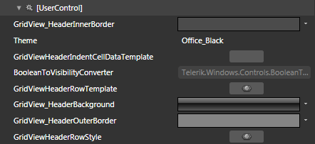
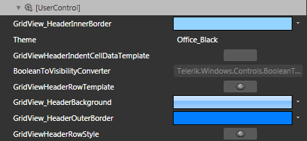

# Styling the Header Row

>tipBefore reading this topic, you might find useful to get familiar with the [Template Structure of the GridViewHeaderRow control](2CD6EAA0-C735-4FA2-B921-A0D1A4452C10#GridViewHeaderRow).

The __RadGridView__ exposes the __HeaderRowStyle__ property of type __Style__. It is applied to the __GridViewHeaderRow__ control inside the __RadGridView__.

You have two options:

* To create an empty style and set it up on your own.

* To copy the default style of the control and modify it.

This topic will show you how to perform the second one.

## Modifying the Default Style

To copy the default style, load your project in Expression Blend and open the User Control that holds the __RadGridView__. In the 'Objects and Timeline' pane select the __RadGridView__ you want to style. From the menu choose *Object -> Edit Additional Styles -> __HeaderRowStyle__ -> Edit a Copy*. You will be prompted for the name of the style and where to be placed.

>tipIf you choose to define the style in Application, it would be available for the entire application. This allows you to define a style only once and then reuse it where needed.

After clicking 'OK', Expression Blend will generate the default style of the __GridViewHeaderRow__ control in the __Resources__ section of your User Control. The properties available for the style will be loaded in the 'Properties' pane and you will be able to modify their default values. You can also edit the generated XAML in the XAML View or in Visual Studio.

If you go to the 'Resources' pane, you will see an editable list of resources generated together with the style and used by it. In this list you will find the brushes, styles and templates needed to change the visual appearance of the __GridViewHeaderRow____.__ Their names indicate to which part of the __GridViewHeaderRow__ appearance they are assigned.

         
      

* __GridView_HeaderInnerBorder__ - a brush that represents the color of the inner border  of the __GridViewHeaderRow__.

* __GridViewHeaderIndentCellDataTemplate__ - the __DataTemplate__, applied to the items of the IndentPresenter.

* __GridViewHeaderRowTemplate__ - the __ControlTemplate__ applied to the __GridViewHeaderRow__.

* __GridView_HeaderBackground__ - a brush that represents the background color of the __GridViewHeaderRow__.

* __GridView_HeaderOuterBorder__ - a brush that represents the color of the outer border of the __GridViewHeaderRow__.

* __GridViewHeaderRowStyle__- the Style applied to the __GridViewHeaderRow__.

Here is an example of these resources modified.

         
      

And here is a snapshot of the result.

         
      

>

As you can see, the changes you've made apply only for the row. The header cells remain unchanged. To learn how to style them take a look at the [Styling the Column Headers]() topic.

# See Also

 * [Styling a Row]()

 * [Styling the Row Details]()

 * [Styling the Group Row]()
