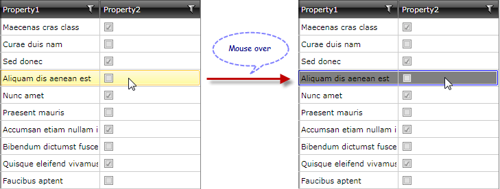
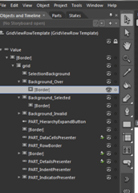
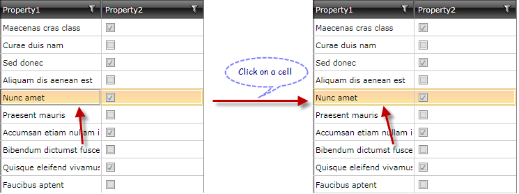

# Override Default RadGridView Styles

This topic will show you how to override the default styles of __RadGridView__. For most of the cases the work includes modifying the default template of either RadGridView or one of its components, e.g. GridViewRow. Modifying the templates is easy if you have Microsoft Expression Blend 4. [This topic]() explains the basics. Let's start with modifying the visual appearance of RadGridView.

* [Modify the mouse over background](#mouse-over-background)

* [Remove the Border of the Current Cell](#remove-the-border-of-the-current-cell)

## Mouse Over Background ##

This example shows how to change the background color and the border of the row when the mouse is over it:

You need to modify the GridViewRow's template. [This topic]() explains the basics. You need to find the __Background_Over__ border element:

#### __XAML__

{{region how-to-override-default-gridview-styles_0}}

	<Border x:Name="Background_Over" 
	        BorderBrush="{StaticResource ItemOuterBorder_Over}" 
	        BorderThickness="1" 
	        Grid.ColumnSpan="2" Grid.Column="2" 
	        CornerRadius="1" Margin="1,1,1,2" telerik:SelectiveScrollingGrid.SelectiveScrollingClip="True" Visibility="Collapsed">
           <Border BorderBrush="{StaticResource ItemInnerBorder_Over}" BorderThickness="1" Background="{StaticResource ItemBackground_Over}"/>
	</Border>
{{endregion}}

Now you can change all the properties you want, e.g. the __BorderBrush__ value will affect the border, the __Background__ will affect the background, etc. We change the values a little to end up with this xaml:

#### __XAML__

{{region how-to-override-default-gridview-styles_1}}

	<Border x:Name="Background_Over" 
	 BorderBrush="Blue" 
	 BorderThickness="1" 
	 Grid.ColumnSpan="2" Grid.Column="2" CornerRadius="1" Margin="1,1,1,2" 
	 telerik:SelectiveScrollingGrid.SelectiveScrollingClip="True" Visibility="Collapsed">
	     <Border BorderBrush="{StaticResource ItemInnerBorder_Over}" BorderThickness="1" Background="Gray"/>
	</Border>
{{endregion}}

Finally, you need to set the __RowStyle__ property of the __RadGridView__ to the style you have just modified.

## Remove the Border of the Current Cell ##

This example shows how to remove the border of the current cell (the one that has been clicked):

You need to edit the style of the GridViewCell. [This topic]() explains the basics. Once you have the style, search for the term "current". You will find a __VisualState__, __Trigger__ and __Border__:

#### __XAML__
	<VisualState x:Name="Current">
    <Storyboard>
        <ObjectAnimationUsingKeyFrames Storyboard.TargetName="Background_Current"
                                       Storyboard.TargetProperty="Visibility">
            <DiscreteObjectKeyFrame KeyTime="0">
                <DiscreteObjectKeyFrame.Value>
                    <Visibility>Visible</Visibility>
                </DiscreteObjectKeyFrame.Value>
            </DiscreteObjectKeyFrame>
        </ObjectAnimationUsingKeyFrames>
    </Storyboard>
	</VisualState>

	...

	<Trigger Property="IsCurrent" Value="True">
	      <Setter Property="Visibility" TargetName="Background_Current" Value="Visible"/>
	</Trigger>
	...
	<Border x:Name="Background_Current"
        Margin="1 1 2 2"
        BorderThickness="1"
        CornerRadius="1"
        BorderBrush="{StaticResource ControlOuterBorder}"
        Grid.Column="2"
        Grid.ColumnSpan="2"
        Visibility="Collapsed"/>

Delete all of them.

Finally, find the __Property="FocusVisualStyle"__ and set its value to null:

#### __XAML__

{{region how-to-override-default-gridview-styles_3}}

	<Setter Property="FocusVisualStyle" Value="{x:Null}" />
{{endregion}}

Now make the style implicit (i.e. do not specify a __x:Key__ attribute) so it will apply to all __GridViewCell__ elements.
