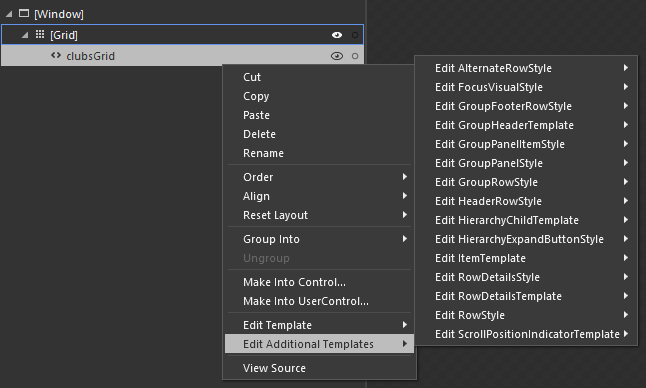
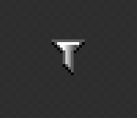
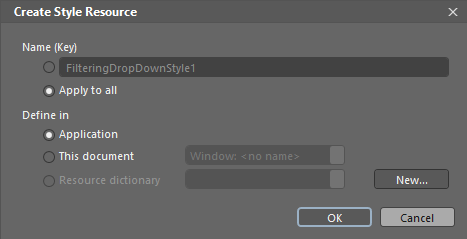
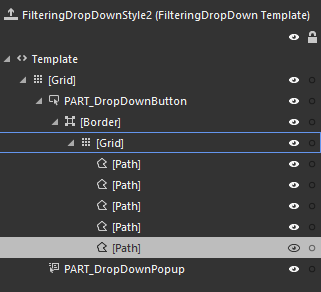
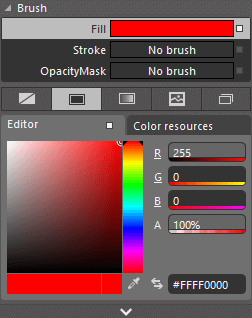
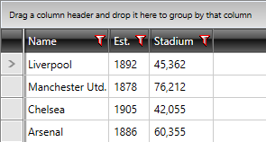
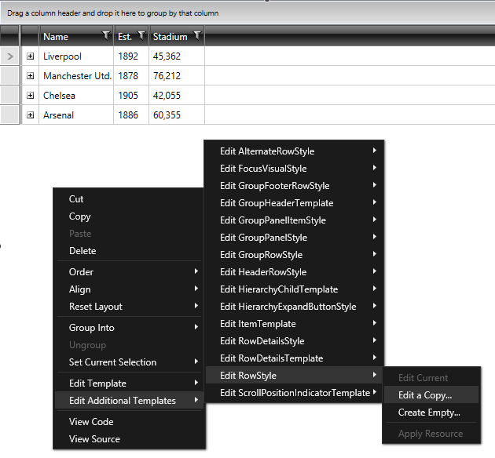

# Modifying Default Styles

This article will show you two ways to modify the default style of a control:

* [Modifying the Default Style Using Microsoft Blend](#modifying-the-default-style-using-microsoft-blend)

* [Modifying the Default Style Using Visual Studio](#modifying-the-default-style-using-visual-studio)

* [Modifying the Default Style By Extracting It From the Theme XAML File](#modifying-the-default-style-by-extracting-it-from-the-theme-xaml-file)

For the purposes of this article, we will modify RadGridView's **FilteringDropDown** element, but the steps described can be applied to every control.

## Modifying the Default Style Using Microsoft Blend

>This article shows how to modify styles using **Blend for Visual Studio 2012**, but the approach should be similar with different versions of the program.

### Editing Additional Styles

The first option to create the needed style is to right-click on your instance of RadGridView and from the context menu select **Edit Additional Templates -> _Desired Style_ -> Edit a Copy**. You can then procede to the [Create Style Resource](#create-style-resource) section.

#### __Figure 1: Editing additional templates__

### Creating a Dummy Control

If you cannot find the desired style from the list of additional styles, you will first need to create a dummy control in Blend. To do so, open the UserControl that hosts your RadGridView in Expression Blend and locate the desired control in the **Assets** tab.

In our case, we can find the FilteringDropDown under **Controls -> All -> FilteringDropDown**.

#### __Figure 2: Selecting the FilteringDropDown from the Assets tab__

You can then double-click or draw to place a dummy control of the selected type on the scene.

#### __Figure 3: The dummy FilteringDropDown__

Right-click on the created dummy control and select **Edit Template -> Edit a Copy**. 

### Create Style Resource

The **Create Style Resource** dialog will prompt you for the name of the style and where to place it within your application.

For this example, we will choose to apply this style to all FilteringDropDown controls and place it in our **App.xaml** file.

>tip If you choose to define the style in the resources of the application, it would be available for the entire application. This allows you to define a style only once and then reuse it where needed.

#### __Figure 4: The "Create Style Resource" window__

After clicking **OK**, the default style of the control will be created in the selected location. If you prefer, you can modify it directly from XAML by right-clicking in the scene and choosing **View Source** from the context menu. The other options is to modify it in Blend as we will do now.

#### __Figure 5: The FilteringDropDown template structure__

>tip Please bear in mind that the control template may be different in the different themes. This example modifies the **OfficeBlack** theme.

>important Note that when changing a __Control Template__ you should include all required parts. Even if your code compiles, some of the functionality may be impacted due to the omission of the required parts. The required parts are usually marked with the prefix "__PART___".

### Modifying the Control Template

To change the funneling icon's border, for example, let's select the **Path** control responsible for the border of the FilteringDropDown from the **Objects and Timeline** pane and set its **Fill** to **Red**.

#### __Figure 6: Changing the fill of the path__

Here is a snapshot of the final result:

#### __Figure 7: The modified FilteringDropDown__

## Modifying the Default Style Using Visual Studio

You could also modify the default style of a control by using the **Design view** of **Visual Studio** similarly to using Blend.

#### __Figure 8: Modifying default styles through Visual Studio's Design view__

## Modifying the Default Style by Extracting it from the Theme XAML File

If you prefer, you can manually extract the needed style from the respective XAML file in the **Themes.Implicit** folder of your **UI for WPF** installation and modify its code to suit your needs.

The process is similar to [manually extracting the Control Template](#extracting-control-templates-manually-from-the-theme-xaml-file) of a given control.

>important Note that when changing a __Control Template__ you should include all required parts. Even if your code compiles, some of the functionality may be impacted due to the omission of the required parts. The required parts are usually marked with the prefix "__PART___".

## See Also

* [Editing Control Templates]()
