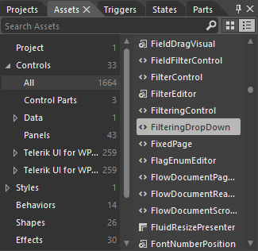

# Modifying Default Styles

This article will show you two ways to modify the default style of a control:

* [Modifying the Default Style Using Microsoft Blend](#modifying-the-default-style-using-microsoft-blend)

* [Modifying the Default Style By Extracting It From the Theme XAML File](#modifying-the-default-style-by-extracting-it-from-the-theme-xaml-file)

For the purposes of this article, we will modify RadGridView's **FilteringDropDown** element, but the steps described can be applied to every control.

## Modifying the Default Style Using Microsoft Blend

To create the needed style, you first need to create a dummy control in Blend. To do so, open the UserControl that hosts your RadGridView in Expression Blend and locate the desired control in the **Assets** tab.

In this case, we can find the FilteringDropDown under **Controls -> All -> FilteringDropDown**.

#### __Figure 1: Selecting the FilteringDropDown from the Assets tab__

You can then double click or draw to place a dummy control of the selected type on the scene.

#### __Figure 2: The dummy FilteringDropDown__

Select the dummy control and from the menu choose **Object -> Edit Style -> Edit a Copy**. You will then be prompted for the name of the style and where to be placed within your application.

For this example, we will choose to apply this style to all FilteringDropDown controls and place it in our **App.xaml** file.

#### __Figure 3: The create style resource window__

After clicking **OK**, the default style of the control is created in the selected location. If you prefer, you can modify it directly from XAML.

The other option is to modify it using Blend. To do so, click on the palette-like breadcrumb icon and select **Edit Template -> Edit Current**.

#### __Figure 4: Edit current template__

You will then see the control's template structure.

#### __Figure 5: The FilteringDropDown template structure__

>tipPlease bear in mind that the control template may be different in the different themes. This example modifies the **OfficeBlack** theme.

To change the funneling icon's border, for example, you need to select the **Path** control responsible for the border of the FilteringDropDown from the **Objects and Timeline** pane.

Let's set the **Fill** of the Path to **Red**.

#### __Figure 6: Changing the fill of the path__

Here is a snapshot of the final result:

#### __Figure 7: Our modified FilteringDropDown__

## Modifying the Default Style By Extracting It From the Theme XAML File

If you prefer, you can manually extract the needed style from the respective XAML file in the **Themes.Implicit** folder of your **UI for WPF** installation.

The process is similar to [manually extracting the Control Template](#extracting-control-templates-manually-from-the-theme-xaml-file) of a given control.

>tipNote that when changing the __ControlTemplate__ you should include all required parts. Even if your code compiles, some of the functionality may be subject to impact due to the omission of the required parts. The required parts are usually marked with the prefix "__PART___".

## See Also

* [Editing Control Templates]()