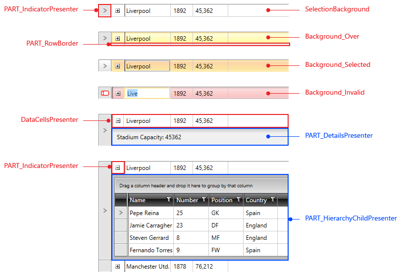
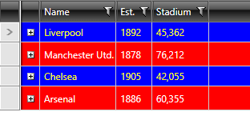

# Styling Rows

>tip Before reading this topic, you might find it useful to get familiar with the [Template Structure of the GridViewRow](#gridviewrow).

> `RadGridView` supports setting the background color of the selected row, as well as setting the mouse-over color of the row. More information can be found in the [SelectedBackground and MouseOverBackground]() article.

#### __GridViewRow template structure__



## Targeting the GridViewRow Element

In order to style all RadGridView rows of an application, you should create an appropriate style targeting the `GridViewRow` element.

You have two options:

* To create an empty style and set it up on your own.

* To copy the default style of the control and modify it.

> To learn how to modify the default `GridViewCell` style, please refer to the [Modifying Default Styles]() article.

__Styling all rows of an application__
```XAML
	<Style TargetType="telerik:GridViewRow">
	    <Setter Property="Background" Value="Red"/>
	    <Setter Property="Foreground" Value="White"/>
	</Style>
```

> If you're using [Implicit Styles](), you should base your style on the __GridViewRowStyle__.

## Setting RadGridView's RowStyle and AlternateRowStyle

`RadGridView` exposes the `RowStyle` and `AlternateRowStyle` properties of type `Style`. `GridViewRow` elements can be styled by providing an appropriate style for each of these properties.

> In order to use the `AlternateRowStyle`, you should first set the `AlternationCount` property of your RadGridView. For example, if you want to alternate each second row, you have to set its value to 2.

__Creating styles for the RowStyle and AlternativeRowStyle properties__

```XAML
	<Application.Resources>
		 <!-- If you use NoXaml dlls set the BasedOn property of the Style: BasedOn="{StaticResource GridViewRowStyle}" -->
		<Style x:Key="GridViewRowStyle" TargetType="telerik:GridViewRow">
			<Setter Property="Background" Value="Red"/>
        	<Setter Property="Foreground" Value="White"/>
		</Style>
		 <!-- If you use NoXaml dlls set the BasedOn property of the Style: BasedOn="{StaticResource GridViewAlternateRowStyle}" -->
		<Style x:Key="GridViewAlternateRowStyle" TargetType="telerik:GridViewRow">
			<Setter Property="Background" Value="Blue"/>
            <Setter Property="Foreground" Value="White"/>
		</Style>
	</Application.Resources>
```

__Applying styles to the RowStyle and AlternateRowStyle properties__
```XAML
	<telerik:RadGridView RowStyle="{StaticResource GridViewRowStyle}"
			     AlternationCount="2"
			     AlternateRowStyle="{StaticResource GridViewAlternateRowStyle}" />
```

#### __RadGridView with styled rows__



## Setting RadGridView's RowStyleSelector and AlternateRowsStyleSelector

You could also use RadGridView's `RowStyleSelector` and `AlternateRowsStyleSelector` properties to style rows differently based on a specific condition. More details about how this can be achieved can be found in the [RowStyleSelector article]().

## See Also

 * [Alternating Rows]()

 * [Styling the Row Details]()

 * [Styling the Group Row]()

 * [Styling the Header Row]()
