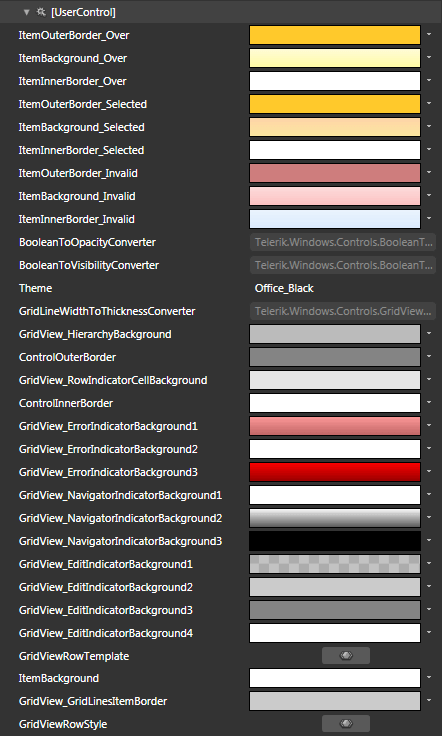

# Styling Rows

>tipBefore reading this topic, you might find useful to get familiar with the [Template Structure of the GridViewRow control]().

__RadGridView__ exposes the __RowStyle and AlternateRowStyle__ properties of type __Style__. They are applied to __GridViewRow__ elements inside __RadGridView__.

You have two options:

* To create an empty style and set it up on your own.
* To copy the default style of the control and modify it.

This topic will show you how to perform the second one.

## Modifying the Default Style

To copy the default style, load your project in Expression Blend and open the User Control that holds the __RadGridView__. In the 'Objects and Timeline' pane select the __RadGridView__ you want to style. From the menu choose *Object -> Edit Additional Styles -> __RowStyle__ -> Edit a Copy*. You will be prompted for the name of the style and where to be placed.

>tipIn order to modify the appearance of the alternating rows you have to modify the __AlternatingRowStyle__. The row styles are identical, so the rest of this topic applies to the __AlternatingRowStyle__, too. To learn more about the __Alternating Rows__ of the __RadGridView__ read [here]().

>tipIf you choose to define the style in Application, it would be available for the entire application. This allows you to define a style only once and then reuse it where needed.

After clicking 'OK', Expression Blend will generate the default style of the __GridViewRow__ control in the __Resources__ section of your User Control. The properties available for the style will be loaded in the 'Properties' pane and you will be able to modify their default values. You can also edit the generated XAML in the XAML View or in Visual Studio.

If you go to the 'Resources' pane, you will see an editable list of resources generated together with the style and used by it. In this list you will find the brushes, styles and templates needed to change the visual appearance of the __GridViewHeaderRow__.Their names indicate to which part of the __GridViewHeaderRow__ appearance they are assigned.



* __ItemOuterBorder_Over__ - a brush that represents the outer border color of the row, when the mouse is over it.

* __ItemBackground_Over__ - a brush that represents the background color of the row, when the mouse is over it.

* __ItemInnerBorder_Over__ - a brush that represents the inner border color of the row, when the mouse is over it.

* __ItemOuterBorder_Selected__ - a brush that represents the outer border color of the row, when it is selected.

* __ItemBackground_Selected__ - a brush that represents the background color of the row, when it is selected.

* __ItemInnerBorder_Selected__ - a brush that represents the inner border color of the row, when it is selected.

* __ItemOuterBorder_Invalid__ - a brush that represents the outer border color of the row, when it is invalid.

* __ItemBackground_Invalid__ - a brush that represents the background color of the row, when it is invalid.

* __ItemInnerBorder_Invalid__ - a brush that represents the inner border color of the row, when it is invalid.

* __GridView_HierarchyBackground__ - a brush that represents the background of container for the __ChildTableDefinitions__.

* __ControlOuterBorder__ - a brush that represents the outer border color of the container for the __ChildTableDefinitions__.

* __GridView_RowIndicatorCellBackground__ - a brush that represents the background color of the indicator cell of the row.

* __ControlInnerBorder__ - a brush that represents the outer border color of the indicator cell of the row.

* __GridView_ErrorIndicatorBackground1__ - a brush that indicates the background color of the first error indicator's __Path__.

* __GridView_ErrorIndicatorBackground2__ - a brush that indicates the background color of the second error indicator's __Path__.

* __GridView_ErrorIndicatorBackground3__ - a brush that indicates the background color of the third error indicator's __Path__.

* __GridView_NavigatorIndicatorBackground1__ - a brush that indicates the background color of the first navigator indicator's __Path__.

* __GridView_NavigatorIndicatorBackground2__ - a brush that indicates the background color of the second navigator indicator's __Path__.

* __GridView_NavigatorIndicatorBackground3__ - a brush that indicates the background color of the third navigator indicator's __Path__.

* __GridView_EditIndicatorBackground1__ - a brush that indicates the background color of the first edit indicator's path.

* __GridView_EditIndicatorBackground2__ - a brush that indicates the background color of the second edit indicator's __Path__.

* __GridView_EditIndicatorBackground3__ - a brush that indicates the background color of the third edit indicator's __Path__.

* __GridView_EditIndicatorBackground4__ - a brush that indicates the background color of the fourth edit indicator's __Path__.

* __GridViewRowTemplate__ - the __ControlTemplate,__ applied to the __GridViewRow__ control.

* __ItemBackground__ - a brush that represents the background color of the row.

* __GridViewRowStyle__ - the __Style,__ applied to the __GridViewRow__.

Here is an example of these resources changed.



# See Also

 * [Alternating Rows]()

 * [Styling the Row Details]()

 * [Styling the Group Row]()

 * [Styling the Header Row]()
