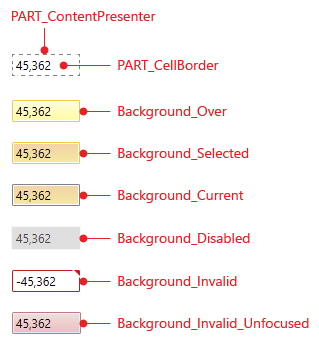
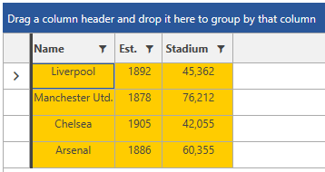
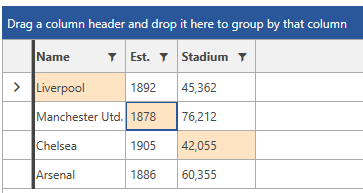
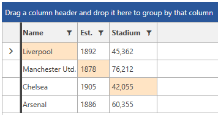
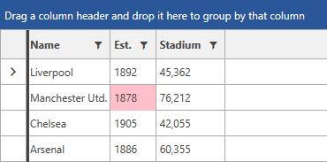
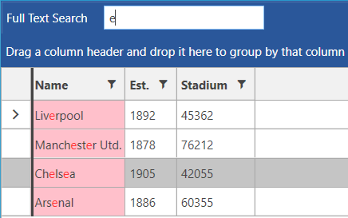

# Styling Cells

In this article, we discuss various approaches to style the RadGridView cells.

__GridViewCell template structure__



## Styling all RadGridView Cells

> The examples from this article assume that the RadGridView is set up as demonstrated in its [Getting Started]() article.

To style all `RadGridView` cells of an application, create a style that targets the `GridViewCell` element.

You have two options:

* To create an empty style and set it up on your own.

* To copy the default style of the control and [modify it]().

__Styling all cells of an application__

```XAML
	<Application.Resources>
        <ResourceDictionary>
            <!-- If you use NoXaml dlls set the BasedOn property of the Style: BasedOn="{StaticResource GridViewCellStyle}" -->
            <Style TargetType="telerik:GridViewCell">
                <Setter Property="VerticalContentAlignment" Value="Top"/>
                <Setter Property="HorizontalContentAlignment" Value="Center"/>
                <Setter Property="Background" Value="#ffcc00"/>
            </Style>
        </ResourceDictionary>
    </Application.Resources>
```

>If you're using [Implicit Styles](), base your style on the `GridViewCellStyle` that is defined for the corresponding theme.

__RadGridView with styled cells in the Office2016 theme__



## Setting a Column's CellStyle

You can also style __RadGridView Cells__ by creating an appropriate `Style` for the `GridViewCell` element and setting it as the `CellStyle` property of the respective __GridView Column__. 

__Setting a column's CellStyle__
```XAML
	<Grid>
        <Grid.Resources>
            <!-- If you use NoXaml dlls set the BasedOn property of the Style: BasedOn="{StaticResource GridViewCellStyle}" -->
            <Style x:Key="GridViewCellStyle" TargetType="telerik:GridViewCell">
                <Setter Property="VerticalContentAlignment" Value="Top"/>
                <Setter Property="HorizontalContentAlignment" Value="Center"/>
                <Setter Property="Background" Value="#ffcc00"/>
            </Style>
        </Grid.Resources>

        <telerik:RadGridView ItemsSource="{Binding Clubs}"
                             AutoGenerateColumns="False"
                             GroupRenderMode="Flat">
            <telerik:RadGridView.Columns>
                <telerik:GridViewDataColumn DataMemberBinding="{Binding Name}"
	                Header="Name"
	                CellStyle="{StaticResource GridViewCellStyle}" />
            </telerik:RadGridView.Columns>
        </telerik:RadGridView>
    </Grid>
```

## Setting a Column's CellStyleSelector

You could also use a column's `CellStyleSelector` property to style cells differently based on a specific condition. For more details about this approach, see the [CellStyleSelector article]().

## Setting the SelectedBackground of the Cell

You can set the Background of the selected cell by setting the `SelectedBackground` property of the GridViewCell element.

__Setting the SelectedBackground of the GridViewCell__
```XAML
	<Application.Resources>
        <ResourceDictionary>
            <!-- If you use NoXaml dlls set the BasedOn property of the Style: BasedOn="{StaticResource GridViewCellStyle}" -->
            <Style TargetType="telerik:GridViewCell">
                <Setter Property="SelectedBackground" Value="Bisque" />
            </Style>
        </ResourceDictionary>
    </Application.Resources>
```

__Result when setting the SelectedBackground property in the Office2016 theme__



## Setting the BorderBrush of the CurrentCell

You can set the BorderBrush of the current cell, by setting the `CurrentBorderBrush` property of the GridViewCell. 

The following example demonstrates how to set the BorderBrush of the current cell to transparent.

__Setting the CurrentBorderBrush of the GridViewCell__
```XAML
	<Application.Resources>
        <ResourceDictionary>
            <!-- If you use NoXaml dlls set the BasedOn property of the Style: BasedOn="{StaticResource GridViewCellStyle}" -->
            <Style TargetType="telerik:GridViewCell">
                <Setter Property="CurrentBorderBrush" Value="Transparent" />
            </Style>
        </ResourceDictionary>
    </Application.Resources>
```

__Result when setting the CurrentBorderBrush property in the Office2016 theme__



> After you have set the `CurrentBorderBrush` to `Transparent`, if you start navigating through the cells with the keyboard, you will be able to see the FocusVisual border. If you want to hide it as well, you can set the `FocusVisualStyle` of the GridViewCell to null through a style similar to the above example.

## Setting the MouseOverBackground of the Cell

You can change the MouseOver Background of the cells through the `MouseOverBackground` property of the GridViewCell. This is demonstrated in the following example.

__Setting the MouseOverBackground of the GridViewCell__
```XAML
	<Application.Resources>
        <ResourceDictionary>
            <!-- If you use NoXaml dlls set the BasedOn property of the Style: BasedOn="{StaticResource GridViewCellStyle}" -->
            <Style TargetType="telerik:GridViewCell" >
                <Setter Property="MouseOverBackground" Value="Pink" />
            </Style>
        </ResourceDictionary>
    </Application.Resources>
```

__Result when setting the MouseOverBackground property in the Office2016 theme__



> In order for the MouseOverBackground of the cell to take effect, set the [SelectionUnit](#selection-units) of RadGridView to `Mixed` or `Cell`.

## Setting the HighlightedBackground of the Cell

You can change the highlighted background color of a matched `GridViewCell` element when search as you type is performed. This color can be modified through the `HighlightedBackground` property.

__Setting the HighlightedBackground of the GridViewCell__
```XAML
    <Application.Resources>
        <ResourceDictionary>
            <!-- If you use NoXaml dlls set the BasedOn property of the Style: BasedOn="{StaticResource GridViewCellStyle}" -->
            <Style TargetType="telerik:GridViewCell" >
                <Setter Property="HighlightedBackground" Value="Pink"/>
            </Style>
        </ResourceDictionary>
    </Application.Resources>
```

__Result when setting the HighlightedBackground property in the Office2016 theme__



## See Also

 * [Styling the GridViewEditorPresenter]()

 * [Styling the Column Footers]()

 * [Styling the Column Headers]()

 * [Change Background for Disabled Grid Elements]()
