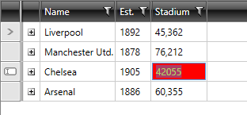

# Styling Column Editor

Each of the columns that derive from __GridViewBoundColumnBase__ have an __EditorStyle__ property that is used to apply an appropriate __Style__ to the column's editor. While creating this style, keep in mind the type of the editor and its properties. Here is a list of some column types and the types of their editors.

| Column Type 						| Editor Type 	|
|-----------------------------------|---------------|
| GridViewDataColumn 				| TextBox 		|
| GridViewComboBoxColumn 			| RadComboBox 	|
| GridViewImageColumn 				| Not Editable 	|
| GridViewSelectColumn 				| Not Editable 	|
| GridViewHyperlinkColumn 			| Not Editable 	|
| GridViewDynamicHyperlinkColumn 	| Not Editable 	|
| GridViewToggleRowDetailsColumn 	| Not Editable 	|

For example, if you want to set the style for the __GridViewDataColumn__'s editor, you have to create a __Style__ that targets the __TextBox__ control.

>To learn how to modify the default styles of a control, please refer to the [Modifying Default Styles]() article.

__Example 1: Styling all text boxes of an application__

```XAML
	<Style x:Key="TextBoxStyle" TargetType="TextBox">
	    <Setter Property="Background" Value="Red"/>
	    <Setter Property="Foreground" Value="Yellow"/>
	    <Setter Property="Padding" Value="2"/>
	</Style>
```

>If you are using [Implicit Styles](), you need to base the style on __TextBoxStyle__.

__Example 2: Setting a column's EditorStyle__

```XAML
	<telerik:GridViewDataColumn EditorStyle="{StaticResource TextBoxStyle}" />
```

#### __Figure 1: RadGridView with styled column edtior__



## See Also

 * [Styling GridViewEditorPresenter]()
