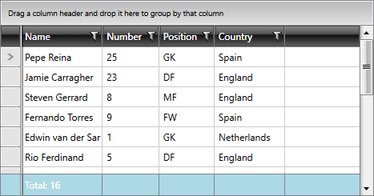
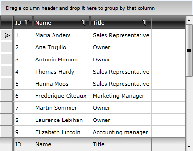

# Styling Column Footers

## Targeting the GridViewFooterRow Element

If you want to style all footer rows of your application, you should create an appropriate style targeting the __GridViewFooterRow__ element.

You have two options:

* To create an empty style and set it up on your own.

* To copy the default style of the control and modify it.

>To learn how to modify the default GridViewFooterRow style, please refer to the [Modifying Default Styles]() article.

__Example 1: Styling all footer rows of an application__

<snippet id='radgridview-styles-and-templates-styling-column-footers-example_1_styling_all_footer_rows_of_an_application-xaml' />

>If you're using [Implicit Styles](), you should base your style on the __GridViewFooterRowStyle__.

## Setting RadGridView's FooterRowStyle

RadGridView's footer rows can also be styled by creating an appropriate __Style__ for the **GridViewFooterRow** element and setting it as RadGridView's __FooterRowStyle__ property. 

__Example 2: Setting RadGridView's FooterRowStyle__

<snippet id='radgridview-styles-and-templates-styling-column-footers-example_2_setting_radgridview_s_footerrowstyle-xaml' />

#### __Figure 1: RadGridView with styled footer rows__

## Targeting the GridViewFooterCell Element

In order to style all RadGridView cells of an application, you should create an appropriate style targeting the __GridViewFooterCell__ element.

__Example 3: Styling all footer cells of an application__

<snippet id='radgridview-styles-and-templates-styling-column-footers-example_3_styling_all_footer_cells_of_an_application-xaml' />

>If you're using [Implicit Styles](), you should base your style on the __GridViewFooterCellStyle__.

## Setting a Column's FooterCellStyle

RadGridView's footer cells can also be styled by creating an appropriate __Style__ for the **GridViewFooterCell** element and setting it as the __FooterCellStyle__ property of the respective __GridViewColumn__. 

__Example 4: Setting a column's CellStyle__

<snippet id='radgridview-styles-and-templates-styling-column-footers-example_4_setting_a_column_s_cellstyle-xaml' />

#### __Figure 2: RadGridView with styled footer cells__

## See Also

 * [Styling a Cell]()

 * [Styling the Column Headers]()
