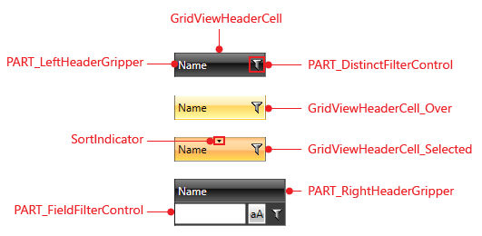
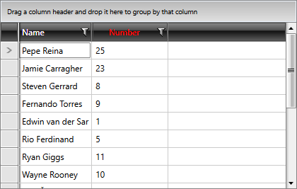

# Styling Column Headers

#### __Figure 1: GridViewHeaderCell template structure__

## Targeting the GridViewHeaderCell element

In order to style all header cells in your application, you should create an appropriate style targeting the __GridViewHeaderCell__ element.

You have two options:

* To create an empty style and set it up on your own.

* To copy the default style of the control and modify it.

>To learn how to modify the default GridViewHeaderCell style, please refer to the [Modifying Default Styles]() article.

The style in **Example 1** will style all the column headers in your application.

__Example 1: Styling all header cells of an application__

<snippet id='radgridview-styles-and-templates-styling-column-headers-example_1_styling_all_header_cells_of_an_application-xaml' />

>If you're using [Implicit Styles](), you need to base your style on the __GridViewHeaderCellStyle__.

## Setting a Column's HeaderCellStyle

__RadGridView__ header cells can also be styled by creating an appropriate __Style__ for the **GridViewHeaderCell** element and setting it as the __HeaderCellStyle__ property of the respective __GridView Column__. 

The style from **Example 2** will only be applied to the **Number** column as we've set its HeaderCellStyle property.

__Example 2: Setting a column's HeaderCellStyle__

<snippet id='radgridview-styles-and-templates-styling-column-headers-example_2_setting_a_column_s_headercellstyle-xaml' />

#### __Figure 2: RadGridView with styled header cell__

## See Also

* [Styling a Cell]()
* [Styling the Column Footers]()