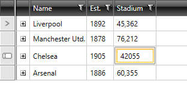

# Styling Editor Presenter

If you want to change the appearance of a cell when it enters edit mode, you should modify the style of the __GridViewEditorPresenter__. This element is a plain presenter used to display the editors for the cells.

>To learn how to modify the default styles of a control, please refer to the [Modifying Default Styles]() article.

>You could also learn how to extract control templates in the [following article]().

#### __[XAML] Example 1: Styling the GridViewEditorPresenter__

	{{region gridview-styling-editorpresenter_1}}
    
	{{endregion}}

>If you're using [Implicit Styles](), you should base your style on the __GridViewEditorPresenterStyle__.

#### __Figure 2: RadGridView with styled GridViewEditorPresenter__

            
>If you would like to change the appearance of the editor itself, then you should create a simple style targeted at the corresponding editor. You can have a look at the [Styling Column Editor]() article for more information.
        
# See Also

 * [Styling Column Editor]()

 * [Modifying Default Styles]()

 * [Editing Control Templates]().
