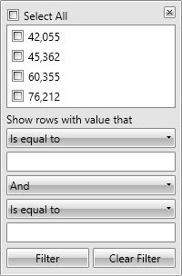

# Styling FilteringControl and FilteringDropDown

In this topic we will discuss:

* [Styling FilteringDropDown](#styling-filteringdropdown)

* [Styling FilteringControl](#styling-filteringcontrol)

>Both controls are located in the **Telerik.Windows.Controls.GridView** namespace of the **Telerik.Windows.Controls.GridView** assembly. When working in **Expression Blend**, the namespaces that are needed will be added automatically.

#### __Figure 1: The FilteringControl & FilteringDropDown template structure__


>tipThe Template Structure of the controls is also available [here]().

## Styling FilteringDropDown

The filtering dropdown icon can be styled by creating an appropriate style targeting the **FilteringDropDown** element.

#### __Figure 2: The default FilteringDropDown element__


To learn how to modify the default FilteringDropDown style, please refer to the [Modifying Default Styles]() article.

## Styling FilteringControl

__GridViewColumn__ exposes the __FilteringControlStyle__ property of type __Style__. It is applied to the __FilteringControl__ of the column.

#### __Figure 3: The default FilteringControl element__



You can modify it similarly to the FilteringDropDown style and set it as follows:

#### __XAML__

```XAML
	<telerik:GridViewDataColumn FilteringControlStyle="{StaticResource FilteringControlStyle}" />
```

>You can find the Template Structure of the FilteringControl [here]().

You are also free to create your own [Custom Filtering Control]() and craft it as you like.

## See Also

 * [Modifying Default Styles]()

 * [Editing Control Templates]()

 * [Filter goes outside the window]()

 * [Styling the FilterRow]()
