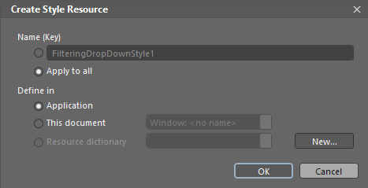

# Styling FilteringControl and FilteringDropDown

>tipBefore reading this topic, you might find useful to get familiar with the [Template Structure]() of the controls.

In this topic we will discuss

* [Styling FilteringDropDown](#styling-filteringdropdown)

* [Styling FilteringFilteringControl](#styling-filteringcontrol)

>Both controls are located in the **Telerik.Windows.Controls.GridView** namespace of the **Telerik.Windows.Controls.GridView** assembly. When working in Expression Blend, the namespaces that are needed will be added automatically.

We will now style each of the controls by copying the default styles of the control and modifying it.

## Styling FilteringDropDown

The filtering dropdown can be styled by creating an appropriate style targeting the **FilteringDropDown** element. 

>As the FilteringDropDown is created dynamically you cannot set the style for it declaratively. The easiest way to do this is to create a theme for your RadGridView control, add the created style for the FilteringDropDown in it and apply the theme to the control.

To create the needed style for the Theme you should use a dummy control. This will allow you to copy the default style for the FilteringDropDown and modify it to your liking. To do so open the UserControl that hosts your RadGridView in Expression Blend.

From the Assets tab select Controls -> All -> FilteringDropDown.

#### __Figure 1: Selecting the FilteringDropDown from the Assets tab__

Draw one dummy control of this type somewhere on the scene.

#### __Figure 2: The dummy FilteringDropDown__

Select it and from the menu choose **Object -> Edit Style -> Edit a Copy**. You will then be prompted for the name of the style and where to be placed within your application.

For this example, we will choose to apply this style to all FilteringDropDown controls and place it in our App.xaml file.

#### __Figure 3: The create style resource window__

After clicking OK, a style for your FilteringDropDown control will be created.

To change the visual appearance of the FilteringDropDown control you have to modify its template. To do that click on the palette-like breadcrumb icon and select Edit Template -> Edit Current.

#### __Figure 4: Edit current template__

To change the funneling icon's border, for example, you need to select the Path control responsible for the border of the FilteringDropDown from the **Objects and Timeline** pane.

#### __Figure 5: The FilteringDropDown template structure__

>tipPlease bear in mind that the control template may be different in the different themes. This example modifies the **Windows8** theme.

Next set Fill of the Path to Red.

#### __Figure 6: Changing the fill of the path__

Here is a snapshot of the final result.

#### __Figure 7: Our modified FilteringDropDown__

## Styling FilteringControl
      
__GridViewColumn__ exposes the __FilteringControlStyle__ property of type __Style__. It is applied to the __FilteringControl__ of the column.

You can modify it similarly to the FilteringDropDown style and set it as follows:

{{region gridview-styling-filteringdropdown_2}}
	<telerik:GridViewDataColumn FilteringControlStyle="{StaticResource FilteringControlStyle}" />
{{endregion}}

>You can find the Template Structure of the FilteringControl [here]().

You are also free to create your [Custom Filtering Control](%slug custom-filtering-controls) and craft it as you like.

# See Also

 * [Filter goes outside the window]()

 * [Styling the FilterRow]()
