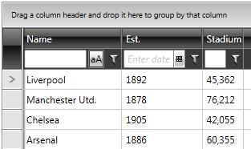
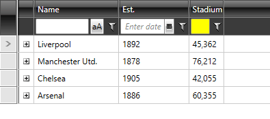

# Styling Filter Row

This article shows how to style the filter row element in RadGridView.



## Type of Editors

The type of the actual editor, which is determined, created and inserted at runtime, depends on the __DataType__ of the column.

Here are the four different scenarios that you can get:

* String: __StringFilterEditor__
* DateTime: __RadDateTimePicker__
* Boolean: Nothing
* Other: __TextBox__

>tipWhen the DataType of the column is of __Boolean__ type, you will have **IsTrue** and **IsFalse** filter operators in the drop-down. For that reason, you do not need an editor.
      
## Modifying the StringFilterEditor's Style

The __StringFilterEditor__ is nothing more than a __TextBox__ and a __ToggleButton__ wrapped in a control. In order to change __StringFilterEditor__'s visual appearance, you should modify its default style.

>To learn how to modify the default StringFilterEditor style, please refer to the [Modifying Default Styles]() article.

__Example 1: Styling the StringFilterEditor__

```XAML
	<Style TargetType="Editors:StringFilterEditor">
	    <Setter Property="Template" Value="{StaticResource StringFilterEditorTemplate}"/>
	    <Setter Property="IsTabStop" Value="False"/>
	    <Setter Property="SnapsToDevicePixels" Value="True"/>
	</Style>
```

>If you're using [Implicit Styles](), you should base your style on the __StringFilterEditorStyle__.
          
## Modifying the FieldFilterControl's Style

In order to change RadDropDownButton's (the funnel) visual appearance, you should create an appropriate style, targeting the **FieldFilterControl** element.

__Example 2: Styling the FieldFilterControl__

```XAML
	<Style TargetType="telerik:FieldFilterControl">
	    <Setter Property="Template" Value="{StaticResource FieldFilterControlTemplate}"/>
	    <Setter Property="Padding" Value="5"/>
	</Style>
```

>If you're using [Implicit Styles](), you should base your style on the __FieldFilterControlStyle__.

## Modifying Other Editors

Since the created editor will be inserted as the **Content** of __PART_FilterEditorContentControl__, you can attach to a __FieldFilterEditorCreated__ event and apply the respective style to the respective editor. For example, if the editor is a plain __TextBox__, you can change its __Background__ like so:

__Example 3: Setting a background for the filtering row TextBox__

```C#
	private void clubsGrid_FieldFilterEditorCreated(object sender, EditorCreatedEventArgs e)
	{
	    if (e.Column.UniqueName == "StadiumCapacity")
	    {
	        TextBox txtBox = e.Editor as TextBox;
	        if (txtBox != null)
	        {
	            txtBox.Background = new SolidColorBrush(Colors.Yellow);
	        }
	    }
	}
```
```VB.NET
	Private Sub clubsGrid_FieldFilterEditorCreated(sender As Object, e As Telerik.Windows.Controls.GridView.EditorCreatedEventArgs)
	    If e.Column.UniqueName = "StadiumCapacity" Then
	        Dim txtBox As TextBox = TryCast(e.Editor, TextBox)
	        If txtBox IsNot Nothing Then
	            txtBox.Background = New SolidColorBrush(Colors.Yellow)
	        End If
	    End If
	End Sub
```

#### __Figure 2: RadGridView with styled filter row__



## See Also

 * [Styling the FilteringControl]()
